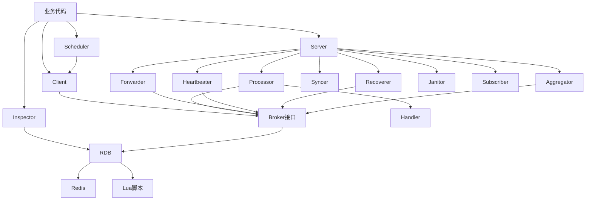

# 架构全景

## 项目概述

**它是什么**：Asynq 是基于 Redis 的 Go 分布式任务队列库。

**为什么存在**：它把后台任务系统常见的能力打包成一个库：任务入队、延迟执行、并发消费、失败重试、任务归档、周期调度、监控查询和队列控制。没有它时，业务系统需要自己维护 Redis 数据结构、worker 进程、状态迁移和异常恢复。

**核心设计理念**：公开 API 保持简单，复杂性藏在内部后台组件和 Redis Lua 脚本中。业务只关心 `Task`、`Client`、`Handler`、`Server`，系统内部负责状态一致性、并发控制和恢复。

## 模块拆解

### 公开 API 层

**它是什么**：业务代码直接接触的类型和函数。

**为什么存在**：任务队列库要把“怎么使用”和“怎么可靠地实现”分开。公开层隐藏 Redis key、Lua 脚本和 worker 协程细节。

**主要文件**：

- `resource/task-queue/asynq/asynq.go:23`：定义 `Task`、`TaskInfo`、任务状态、Redis 连接配置和 `ResultWriter`。
- `resource/task-queue/asynq/client.go:28`：定义 `Client` 和入队选项。
- `resource/task-queue/asynq/server.go:36`：定义 `Server`、`Config`、`Handler` 和错误处理扩展点。
- `resource/task-queue/asynq/servemux.go:29`：定义任务类型到 handler 的路由器和中间件机制。
- `resource/task-queue/asynq/scheduler.go:24`：定义基于 cron 的调度器。
- `resource/task-queue/asynq/inspector.go:22`：定义队列和任务检查接口。

### Server 运行时层

**它是什么**：一个 `Server` 由多个后台组件组成，不只是一个 worker 循环。

**为什么存在**：任务队列的生产能力不只靠消费任务。它还需要把定时任务转入待处理队列、延长任务租约、恢复崩溃 worker 留下的任务、清理过期任务和暴露运行状态。

**主要文件**：

- `resource/task-queue/asynq/server.go:506`：在构造函数里创建 `rdb`、`syncer`、`heartbeater`、`forwarder`、`subscriber`、`processor`、`recoverer`、`healthchecker`、`janitor`、`aggregator`。
- `resource/task-queue/asynq/server.go:680`：`Start` 设置 handler 并启动所有后台组件。
- `resource/task-queue/asynq/processor.go:27`：负责拉取任务和启动 worker goroutine。
- `resource/task-queue/asynq/forwarder.go:15`：负责把 scheduled/retry 到期任务转成 pending。
- `resource/task-queue/asynq/heartbeat.go:18`：负责写 server/worker 心跳并延长 lease。
- `resource/task-queue/asynq/recoverer.go:80`：负责回收 lease 过期任务。
- `resource/task-queue/asynq/syncer.go:14`：负责重试失败的 Redis 状态同步操作。
- `resource/task-queue/asynq/aggregator.go:16`：负责把同组任务聚合成一个任务。

### Broker 与 Redis 层

**它是什么**：内部的消息代理抽象和 Redis 实现。

**为什么存在**：业务层不应该知道任务存在 Redis 的 list、zset、hash 里。`base.Broker` 把任务队列需要的操作抽象出来，`rdb.RDB` 用 Redis 实现这些操作。

**主要文件**：

- `resource/task-queue/asynq/internal/base/base.go:695`：定义 `Broker` 接口。
- `resource/task-queue/asynq/internal/rdb/rdb.go:28`：定义 Redis 实现 `RDB`。
- `resource/task-queue/asynq/internal/rdb/rdb.go:98`：入队 Lua 脚本。
- `resource/task-queue/asynq/internal/rdb/rdb.go:356`：出队并创建 lease。
- `resource/task-queue/asynq/internal/rdb/rdb.go:916`：失败重试状态迁移。
- `resource/task-queue/asynq/internal/rdb/rdb.go:1018`：归档状态迁移。

### 调度与周期任务层

**它是什么**：把时间表达式转化成未来的入队动作。

**为什么存在**：很多后台任务不是外部请求触发，而是按时间周期产生。Asynq 把“何时产生任务”和“任务如何被 worker 处理”拆开。

**主要文件**：

- `resource/task-queue/asynq/scheduler.go:181`：cron job 到任务入队的桥接。
- `resource/task-queue/asynq/scheduler.go:208`：注册周期任务。
- `resource/task-queue/asynq/periodic_task_manager.go:17`：周期任务配置同步器。

## 模块依赖关系

### 依赖图中的组件职责

| 组件 | 它是什么 | 核心职责 | 为什么依赖关系这样设计 |
|------|----------|----------|------------------------|
| 业务代码 | 使用 Asynq 的应用层代码 | 创建任务、调用 `Client` 入队、启动 `Server` 消费任务、注册 `Handler`、用 `Inspector` 查看队列状态 | 业务代码只接触公开 API，不直接操作 Redis key 和内部状态机。 |
| `Client` | 任务生产者 | 校验 `Task`，合并入队选项，生成 `TaskMessage`，调用 `Broker` 写入 pending、scheduled 或 group | 入队逻辑需要复用内部 Redis 状态迁移，但业务侧不应该知道 Redis 数据结构。 |
| `Server` | worker 运行时总控 | 创建并启动 processor、forwarder、heartbeater、recoverer、syncer、aggregator、janitor、subscriber 等后台组件 | 单个 worker 服务不是一个循环，而是一组协作后台任务；`Server` 负责生命周期编排。 |
| `Scheduler` | 周期任务调度器 | 解析 cron 表达式，到点后通过 `Client` 把任务入队，并记录 scheduler entry 和入队历史 | 周期任务本质上还是任务生产行为，所以调度器依赖 `Client`，不直接绕过入队路径。 |
| `Inspector` | 队列与任务检查工具 | 查询队列列表、统计、任务详情，支持运行、归档、删除、暂停和恢复队列 | 检查和管理需要读取 Redis 的实际状态，所以它直接依赖 `RDB` 的 inspect 能力，而不是只走 `Broker` 接口。 |
| `Processor` | 任务消费器 | 从队列取任务，创建 worker goroutine，调用 `Handler`，根据结果把任务置为完成、重试、归档或重新入队 | 它是业务 handler 和内部状态机之间的桥，既要依赖 `Handler`，也要依赖 `Broker` 完成状态迁移。 |
| `Handler` | 业务处理边界 | 根据任务类型和载荷执行真实业务逻辑，返回成功、失败、跳过重试或撤销任务 | Asynq 把“任务如何处理”交给业务，把“失败后怎么迁移状态”留给 processor。 |
| `Forwarder` | 延迟任务推进器 | 周期扫描 scheduled 和 retry，把到期任务转入 pending；如果任务有 group，则转入聚合分组 | 延迟和重试不由 processor 主动扫描，避免消费路径承担时间调度职责。 |
| `Heartbeater` | 运行状态和租约维护器 | 周期写入 server/worker 快照，并延长 active 任务 lease | active 任务需要租约防丢，服务状态也需要可观测；这两个都适合由独立心跳组件维护。 |
| `Recoverer` | 异常恢复器 | 扫描 lease 过期任务，把 worker 崩溃或超时留下的 active 任务转 retry 或 archived；回收超时 aggregation set | 它让系统不依赖 worker 正常退出，承认进程可能崩溃，并用 Redis 状态恢复任务。 |
| `Syncer` | 状态同步补偿器 | 缓存 processor 中未能成功写入 Redis 的补偿操作，并后台重试 | Redis 写入可能临时失败；syncer 减少任务状态卡死在 active 的概率。 |
| `Aggregator` | 聚合任务处理器 | 检查 group 是否达到聚合条件，读取 aggregation set，调用用户提供的聚合函数生成新任务 | 聚合是任务入队前后的特殊缓冲层，单独拆出可以让普通消费路径保持简单。 |
| `Janitor` | 过期数据清理器 | 删除 completed 中已经过 retention 的任务和对应 task hash | 成功任务可以按配置保留结果，但保留期过后需要后台清理，避免 Redis 无限增长。 |
| `Subscriber` | 取消通知订阅器 | 订阅 `asynq:cancel` 通道，收到 task ID 后取消正在执行的任务上下文 | 取消请求可能来自外部 inspector/API，需要通过 Redis PubSub 广播到正在处理任务的 server。 |
| `Broker接口` | 内部消息代理抽象 | 定义入队、出队、完成、重试、归档、调度推进、租约、聚合、心跳和取消等操作 | 运行时组件依赖任务队列语义，而不是依赖 Redis 客户端细节。 |
| `RDB` | `Broker` 的 Redis 实现 | 把 `Broker` 操作落到 Redis list、zset、hash、string、pubsub 和 Lua 脚本上 | Redis 是实际持久化和跨进程协调层；`RDB` 集中管理 key、脚本和错误转换。 |
| `Redis` | 持久化和协调后端 | 保存任务详情、状态集合、租约、统计、心跳、调度历史和取消消息 | 分布式 worker 需要共享状态，Redis 提供低延迟数据结构和原子脚本执行能力。 |
| `Lua脚本` | Redis 内原子状态迁移逻辑 | 保证入队、出队、完成、重试、归档、聚合切分等多 key 操作一次性完成 | Asynq 的状态迁移通常涉及多个 key，Lua 脚本避免中间态暴露给其他 worker。 |

补充说明：`Healthchecker` 也是 `Server` 启动的后台组件，但上图没有单独画出。它定期调用 `Broker.Ping()`，再把结果交给用户配置的 healthcheck 回调，主要用于服务健康探测而不是任务状态迁移。

## 核心抽象

- `Task`：业务任务的最小公开表示，包含类型、载荷、头信息和选项，见 `asynq.go:23`。
- `TaskMessage`：内部持久化表示，包含任务状态迁移需要的元信息，见 `internal/base/base.go:234`。
- `Client`：任务生产者，负责把公开任务转成内部消息并写入 Redis，见 `client.go:28`。
- `Server`：任务消费者运行时，负责组装所有后台组件，见 `server.go:36`。
- `Handler`：业务处理函数边界，见 `server.go:638`。
- `Broker`：内部消息代理接口，见 `internal/base/base.go:698`。
- `RDB`：`Broker` 的 Redis 实现，见 `internal/rdb/rdb.go:28`。
- `ServeMux`：按任务类型分发 handler 的路由器，见 `servemux.go:29`。

## 扩展机制

**它是什么**：Asynq 提供 handler、中间件、错误处理器、重试延迟函数、任务聚合器、调度回调和 Redis 连接配置作为扩展点。

**为什么这么设计**：任务队列的核心应稳定，业务差异主要在“如何处理任务”“如何分类任务”“失败如何告警”“重试如何计算”“周期任务配置从哪里来”。这些差异通过接口和函数注入，而不是让业务改内部状态机。
