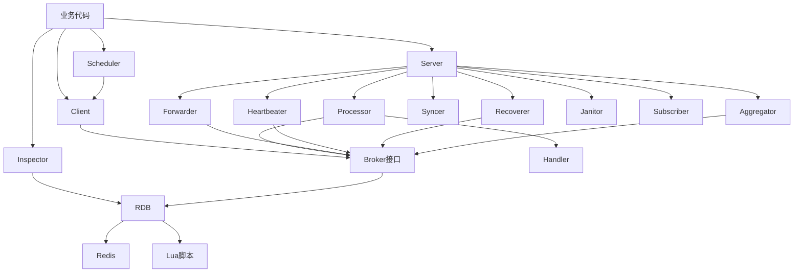

# 架构全景

## 项目概述

**它是什么**：Asynq 是基于 Redis 的 Go 分布式任务队列库。

**为什么存在**：它把后台任务系统常见的能力打包成一个库：任务入队、延迟执行、并发消费、失败重试、任务归档、周期调度、监控查询和队列控制。没有它时，业务系统需要自己维护 Redis 数据结构、worker 进程、状态迁移和异常恢复。

**核心设计理念**：公开 API 保持简单，复杂性藏在内部后台组件和 Redis Lua 脚本中。业务只关心 `Task`、`Client`、`Handler`、`Server`，系统内部负责状态一致性、并发控制和恢复。

## 模块拆解

### 公开 API 层

**它是什么**：业务代码直接接触的类型和函数。

**为什么存在**：任务队列库要把“怎么使用”和“怎么可靠地实现”分开。公开层隐藏 Redis key、Lua 脚本和 worker 协程细节。

**主要文件**：

- `resource/task-queue/asynq/asynq.go:23`：定义 `Task`、`TaskInfo`、任务状态、Redis 连接配置和 `ResultWriter`。
- `resource/task-queue/asynq/client.go:28`：定义 `Client` 和入队选项。
- `resource/task-queue/asynq/server.go:36`：定义 `Server`、`Config`、`Handler` 和错误处理扩展点。
- `resource/task-queue/asynq/servemux.go:29`：定义任务类型到 handler 的路由器和中间件机制。
- `resource/task-queue/asynq/scheduler.go:24`：定义基于 cron 的调度器。
- `resource/task-queue/asynq/inspector.go:22`：定义队列和任务检查接口。

### Server 运行时层

**它是什么**：一个 `Server` 由多个后台组件组成，不只是一个 worker 循环。

**为什么存在**：任务队列的生产能力不只靠消费任务。它还需要把定时任务转入待处理队列、延长任务租约、恢复崩溃 worker 留下的任务、清理过期任务和暴露运行状态。

**主要文件**：

- `resource/task-queue/asynq/server.go:506`：在构造函数里创建 `rdb`、`syncer`、`heartbeater`、`forwarder`、`subscriber`、`processor`、`recoverer`、`healthchecker`、`janitor`、`aggregator`。
- `resource/task-queue/asynq/server.go:680`：`Start` 设置 handler 并启动所有后台组件。
- `resource/task-queue/asynq/processor.go:27`：负责拉取任务和启动 worker goroutine。
- `resource/task-queue/asynq/forwarder.go:15`：负责把 scheduled/retry 到期任务转成 pending。
- `resource/task-queue/asynq/heartbeat.go:18`：负责写 server/worker 心跳并延长 lease。
- `resource/task-queue/asynq/recoverer.go:80`：负责回收 lease 过期任务。
- `resource/task-queue/asynq/syncer.go:14`：负责重试失败的 Redis 状态同步操作。
- `resource/task-queue/asynq/aggregator.go:16`：负责把同组任务聚合成一个任务。

### Broker 与 Redis 层

**它是什么**：内部的消息代理抽象和 Redis 实现。

**为什么存在**：业务层不应该知道任务存在 Redis 的 list、zset、hash 里。`base.Broker` 把任务队列需要的操作抽象出来，`rdb.RDB` 用 Redis 实现这些操作。

**主要文件**：

- `resource/task-queue/asynq/internal/base/base.go:695`：定义 `Broker` 接口。
- `resource/task-queue/asynq/internal/rdb/rdb.go:28`：定义 Redis 实现 `RDB`。
- `resource/task-queue/asynq/internal/rdb/rdb.go:98`：入队 Lua 脚本。
- `resource/task-queue/asynq/internal/rdb/rdb.go:356`：出队并创建 lease。
- `resource/task-queue/asynq/internal/rdb/rdb.go:916`：失败重试状态迁移。
- `resource/task-queue/asynq/internal/rdb/rdb.go:1018`：归档状态迁移。

### 调度与周期任务层

**它是什么**：把时间表达式转化成未来的入队动作。

**为什么存在**：很多后台任务不是外部请求触发，而是按时间周期产生。Asynq 把“何时产生任务”和“任务如何被 worker 处理”拆开。

**主要文件**：

- `resource/task-queue/asynq/scheduler.go:181`：cron job 到任务入队的桥接。
- `resource/task-queue/asynq/scheduler.go:208`：注册周期任务。
- `resource/task-queue/asynq/periodic_task_manager.go:17`：周期任务配置同步器。

## 模块依赖关系

## 核心抽象

- `Task`：业务任务的最小公开表示，包含类型、载荷、头信息和选项，见 `asynq.go:23`。
- `TaskMessage`：内部持久化表示，包含任务状态迁移需要的元信息，见 `internal/base/base.go:234`。
- `Client`：任务生产者，负责把公开任务转成内部消息并写入 Redis，见 `client.go:28`。
- `Server`：任务消费者运行时，负责组装所有后台组件，见 `server.go:36`。
- `Handler`：业务处理函数边界，见 `server.go:638`。
- `Broker`：内部消息代理接口，见 `internal/base/base.go:698`。
- `RDB`：`Broker` 的 Redis 实现，见 `internal/rdb/rdb.go:28`。
- `ServeMux`：按任务类型分发 handler 的路由器，见 `servemux.go:29`。

## 扩展机制

**它是什么**：Asynq 提供 handler、中间件、错误处理器、重试延迟函数、任务聚合器、调度回调和 Redis 连接配置作为扩展点。

**为什么这么设计**：任务队列的核心应稳定，业务差异主要在“如何处理任务”“如何分类任务”“失败如何告警”“重试如何计算”“周期任务配置从哪里来”。这些差异通过接口和函数注入，而不是让业务改内部状态机。
