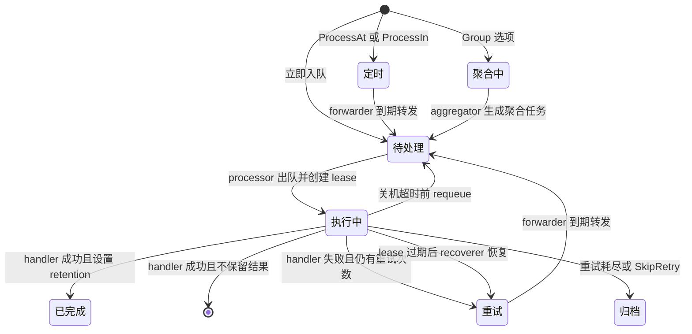

# 核心机制：任务生命周期

## 这是什么机制

**它是什么**：任务生命周期是一个任务从业务代码创建，到进入 Redis，再被 worker 取出执行，最后变成成功、重试、归档或保留结果的状态流转。

**为什么需要它**：后台任务的难点不是“调用一个函数”，而是调用失败、进程崩溃、并发执行、延迟调度和重复执行时仍能知道任务在哪里、下一步该做什么。

**设计核心**：用 Redis 数据结构表达状态，用 Lua 脚本完成关键状态迁移，用 Go 协程驱动状态推进。

## 调用链

```text
业务代码创建任务
  -> NewTask / NewTaskWithHeaders（asynq.go:53, asynq.go:67）
  -> Client.EnqueueContext（client.go:385）
  -> composeOptions 合并并校验选项（client.go:272）
  -> 构造 TaskMessage（client.go:414）
  -> 按时间和分组选择入队路径（client.go:433）
     -> enqueue / schedule / addToGroup（client.go:600, client.go:607, client.go:615）
        -> RDB.Enqueue / RDB.Schedule / RDB.AddToGroup（internal/rdb/rdb.go:111, internal/rdb/rdb.go:771, internal/rdb/rdb.go:646）
```

```text
Server 启动消费
  -> NewServerFromRedisClient 组装后台组件（server.go:444）
  -> Server.Start 设置 handler 并启动组件（server.go:680）
  -> processor.start 循环执行（processor.go:152）
  -> processor.exec 获取并执行任务（processor.go:170）
  -> RDB.Dequeue 原子移动 pending -> active + lease（internal/rdb/rdb.go:356）
  -> Handler.ProcessTask（processor.go:446）
  -> 成功：Done 或 MarkAsComplete（processor.go:276）
  -> 失败：Retry 或 Archive（processor.go:335）
```

## 状态流转图



## 关键实现

### 任务创建与选项合并

`Task` 只暴露类型、载荷、头信息和选项，真正用于持久化的是 `TaskMessage`。`Client.EnqueueContext` 会把 `Task` 和入队选项合并：默认队列、默认重试次数、任务编号、超时、deadline、唯一性、定时、分组等都在这里收敛，见 `client.go:385` 到 `client.go:456`。

这样设计的原因是：业务创建任务时可以设置默认选项，真正入队时还可以覆盖它们。配置合并集中在 client 侧，Redis 层只接收已经归一化的消息。

### 原子状态迁移

入队脚本会先检查任务 hash 是否存在，再写入任务消息并把任务 ID 放入 pending list，见 `internal/rdb/rdb.go:98` 到 `internal/rdb/rdb.go:108`。出队脚本会把 ID 从 pending 移到 active，并写入 lease zset，见 `internal/rdb/rdb.go:356` 到 `internal/rdb/rdb.go:383`。

这是任务队列最关键的可靠性边界：每次状态迁移必须是“移出旧状态 + 写入新状态 + 更新任务 hash”的一个原子动作，否则 worker 崩溃或 Redis 网络抖动时会出现幽灵任务或丢任务。

### 租约与恢复

processor 取到任务后会创建 lease，并把 worker 信息发送给 heartbeater，见 `processor.go:196` 到 `processor.go:205`。heartbeater 周期性写 server/worker 状态，并调用 `ExtendLease` 延长 lease，见 `heartbeat.go:144` 到 `heartbeat.go:201`。

如果 worker 崩溃或心跳断掉，recoverer 会找出 lease 过期任务，再根据重试次数决定进入 retry 或 archive，见 `recoverer.go:84` 到 `recoverer.go:124`。

### 成功、失败和补偿

handler 成功后，若任务设置了 retention，则进入 completed；否则直接删除任务 hash 并统计成功，见 `processor.go:276` 到 `processor.go:324`。handler 失败后，`handleFailedMessage` 根据 `RevokeTask`、`SkipRetry`、最大重试次数和自定义失败判断，选择 done、archive 或 retry，见 `processor.go:335` 到 `processor.go:348`。

如果执行 Redis 状态迁移失败，processor 会把补偿操作交给 syncer 重试，见 `processor.go:291` 到 `processor.go:302`、`syncer.go:14` 到 `syncer.go:31`。

## 设计决策

1. **为什么不用阻塞 pop**：processor 在队列空时 sleep 加抖动，源码注释说明没有使用阻塞 pop，而是轮询队列，见 `processor.go:178` 到 `processor.go:185`。这带来 Redis 负载，但方便统一处理多个队列优先级和暂停状态。
2. **为什么需要 lease**：active 只是“任务被取走”，不是“任务一定完成”。lease 让系统能发现 worker 崩溃，避免任务永久卡在 active。
3. **为什么成功任务默认删除**：大多数后台任务只关心是否完成，不需要保存结果。只有设置 retention 时才进入 completed，降低 Redis 存储压力。
4. **为什么失败路径分 retry 和 archive**：retry 代表未来还要处理，archive 代表终止处理但保留检查能力。二者语义不同，所以对应不同 zset。
