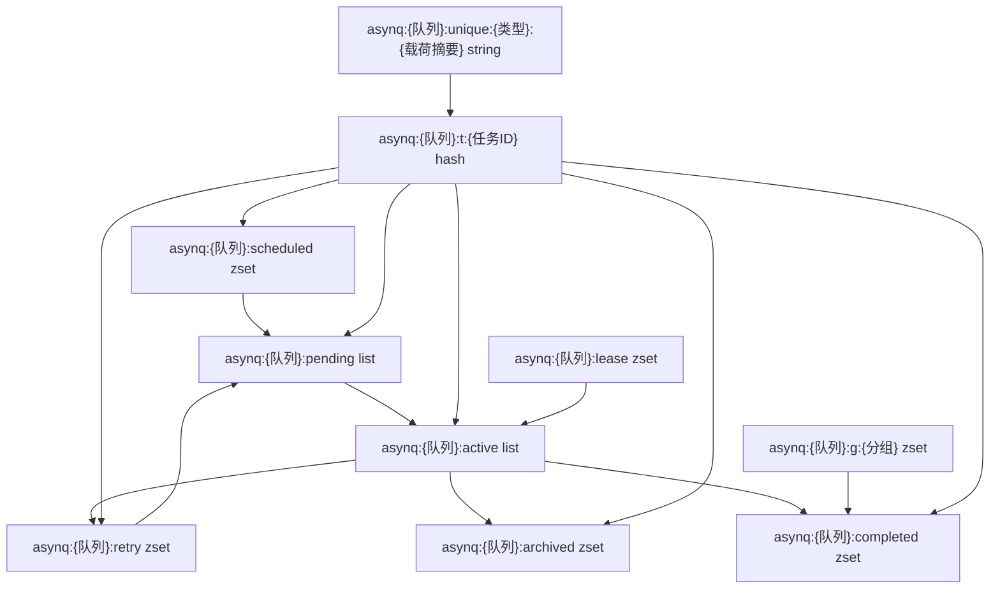

# 数据流与状态管理

## 核心数据结构

### Task

**它是什么**：公开的业务任务对象，代表“要执行的一件事”，见 `resource/task-queue/asynq/asynq.go:23`。

**为什么这样建模**：业务侧只需要类型和载荷。类型用于路由到 handler，载荷由业务自己决定编码方式，选项用于描述任务行为。

**字段说明**：

- `typename`：任务类型。
- `payload`：任务数据。
- `headers`：附加元信息。
- `opts`：默认处理选项。
- `w`：运行时注入的结果写入器，只在 handler 收到的任务里有效。

### TaskMessage

**它是什么**：内部持久化任务消息，写入 Redis hash 的 `msg` 字段，见 `internal/base/base.go:234`。

**为什么这样建模**：任务进入队列后，系统需要知道它的状态迁移上下文，不只是业务载荷。比如重试次数、上次错误、超时、deadline、唯一性 key、分组 key、保留时间等。

**字段说明**：

- `ID`：任务唯一标识。
- `Queue`：所在队列。
- `Retry` / `Retried`：最大重试次数和已经重试次数。
- `ErrorMsg` / `LastFailedAt`：失败上下文。
- `Timeout` / `Deadline`：任务执行边界。
- `UniqueKey`：唯一任务锁。
- `GroupKey`：聚合任务所属分组。
- `Retention` / `CompletedAt`：成功后是否保留结果。

### Broker

**它是什么**：内部消息代理接口，见 `internal/base/base.go:698`。

**为什么这样建模**：Server、processor、forwarder、recoverer 不直接依赖 Redis 客户端，而是依赖任务队列语义。例如入队、出队、重试、归档、延长 lease、写结果。这让内部模块的职责更清楚。

### Redis key

**它是什么**：任务状态在 Redis 中的物理表示，见 `internal/base/base.go:105` 到 `internal/base/base.go:231`。

**为什么这样建模**：不同状态需要不同数据结构。pending 需要队列语义，所以用 list；scheduled/retry/archive/completed 需要按时间排序，所以用 zset；任务详情需要按任务 ID 查询，所以用 hash。

## Redis 状态空间

## 数据生命周期

**它从哪里来**：业务代码调用 `NewTask` 创建任务，再用 `Client.Enqueue` 或 `Client.EnqueueContext` 入队，见 `client.go:369` 和 `client.go:385`。

**经历什么转换**：

1. `Task` 合并选项后转成 `TaskMessage`，见 `client.go:414`。
2. `TaskMessage` 被 protobuf 编码，见 `internal/base/base.go:302`。
3. RDB 用 Lua 脚本写入任务 hash，并把任务 ID 放入 pending、scheduled 或 group，见 `internal/rdb/rdb.go:111`、`internal/rdb/rdb.go:771`、`internal/rdb/rdb.go:646`。
4. processor 出队时把 pending 转 active，并写 lease，见 `internal/rdb/rdb.go:356`。
5. 成功、失败、重试、归档由 processor 调用 Broker 方法更新 Redis 状态，见 `processor.go:276` 和 `processor.go:335`。

**到哪里去**：

- 成功且无保留：从 active 和任务 hash 中删除。
- 成功且有 retention：进入 completed。
- 失败且可重试：进入 retry。
- 失败且不可重试：进入 archived。
- 定时任务到期：由 forwarder 从 scheduled/retry 转回 pending。

## 状态管理

**它是什么**：Asynq 有两类状态：任务状态和运行时状态。任务状态在 Redis 中，运行时状态在 Server 内存和 Redis 心跳中。

**为什么这样管理**：任务状态必须跨进程、跨重启存在，所以放 Redis。运行时状态只用于可观测和租约维护，所以由 heartbeater 周期性写入 Redis，并设置 TTL。

## 并发与一致性

### Go 侧并发

processor 用 `sema chan struct{}` 控制最大并发，见 `processor.go:53` 和 `processor.go:174`。每个任务用独立 goroutine 执行 handler，见 `processor.go:199` 到 `processor.go:257`。

### Redis 侧一致性

关键迁移使用 Lua 脚本，保证单次迁移原子性。例如入队脚本见 `internal/rdb/rdb.go:98`，重试脚本见 `internal/rdb/rdb.go:884`，归档脚本见 `internal/rdb/rdb.go:973`。

### 租约一致性

出队时创建 lease，heartbeater 延长 lease，recoverer 根据 lease 过期恢复任务。这个设计承认 worker 可能崩溃，不假设任务一旦 active 就一定完成。

### 批量入队边界

`BatchEnqueue` 使用 pipeline 执行多个独立 Lua 脚本，不提供整批事务，见 `client.go:465` 到 `client.go:481` 和 `internal/rdb/rdb.go:142` 到 `internal/rdb/rdb.go:156`。这意味着调用方要能接受部分成功。
