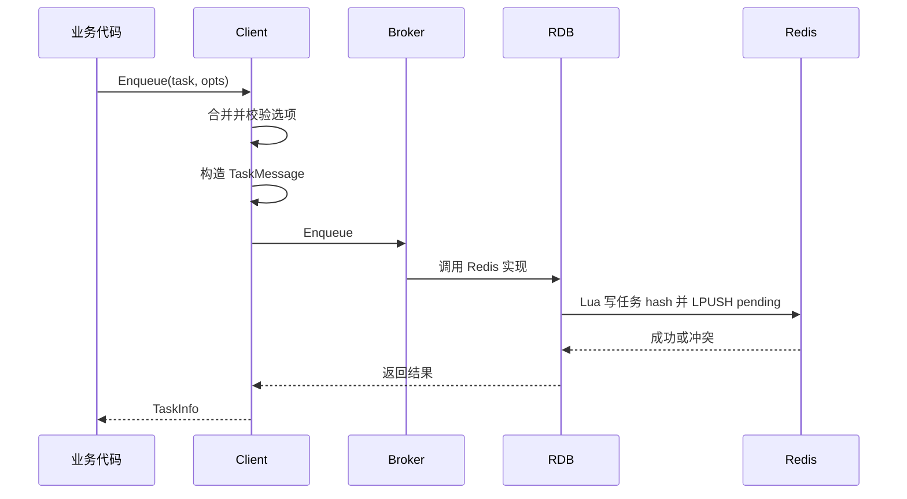
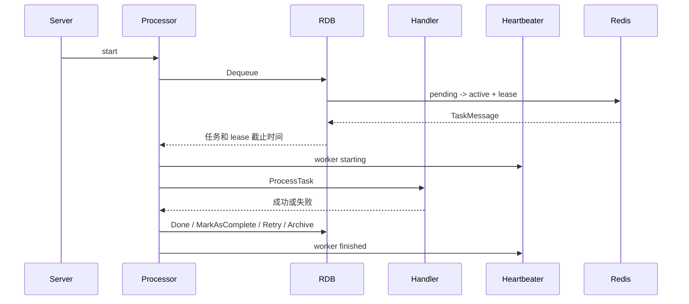
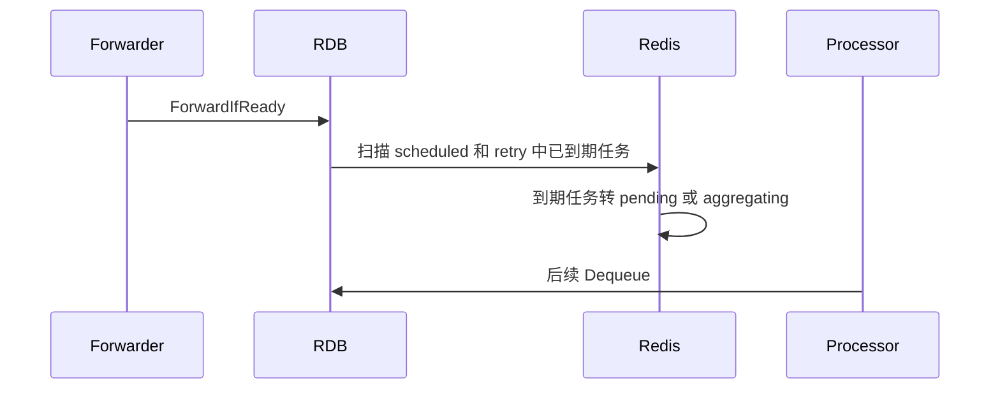
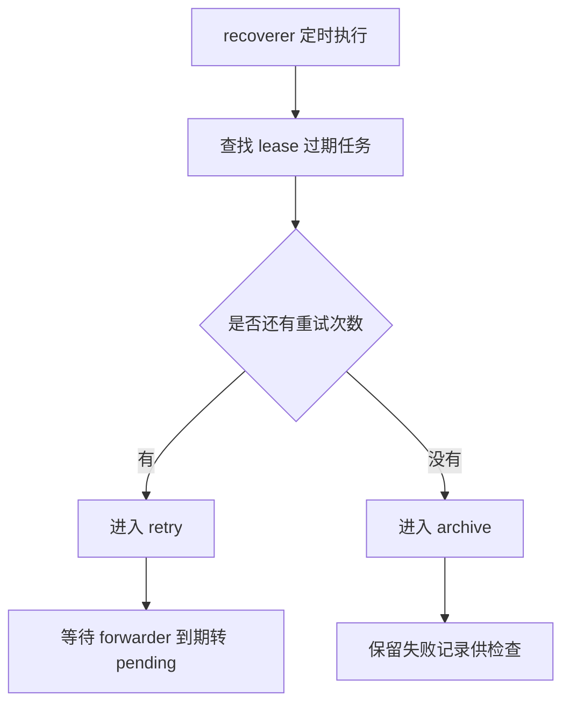
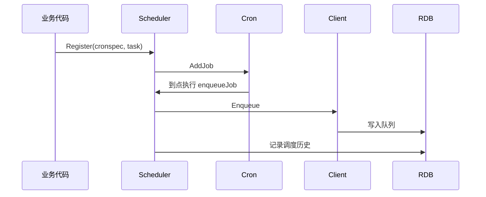
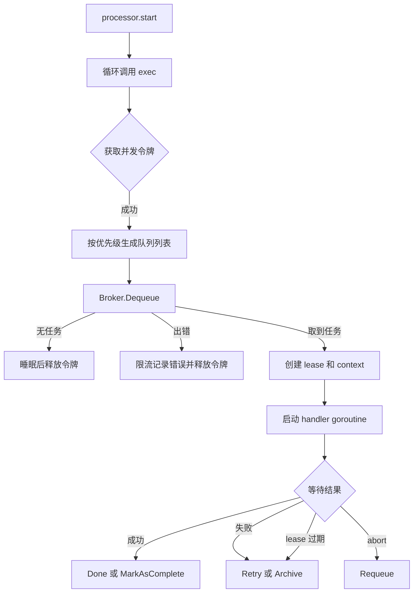
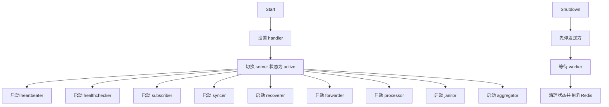
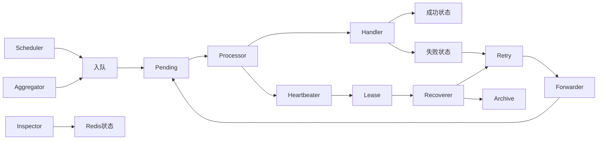

# 核心工作流

## 端到端业务流程

### 流程一：立即任务入队

**它是什么**：业务代码把一个任务放入队列，等待 worker 处理。

**触发方式**：调用 `Client.Enqueue` 或 `Client.EnqueueContext`。

| 步骤 | 负责模块 | 做什么 | 为什么在这一步 | 代码位置 |
|------|----------|--------|----------------|----------|
| 1 | Client | 检查 task 是否为空、类型是否为空 | 先在本地拒绝明显非法输入 | `client.go:385` |
| 2 | Client | 合并任务默认选项和入队选项 | 支持创建时默认、入队时覆盖 | `client.go:392` |
| 3 | Client | 构造 `TaskMessage` | 转成内部持久化模型 | `client.go:414` |
| 4 | RDB | 写任务 hash 和 pending list | 原子创建任务状态 | `internal/rdb/rdb.go:98` |

### 流程二：worker 消费任务

**它是什么**：Server 从队列取任务，并发执行 handler。

**触发方式**：调用 `Server.Start` 或 `Server.Run`。

| 步骤 | 负责模块 | 做什么 | 为什么在这一步 | 代码位置 |
|------|----------|--------|----------------|----------|
| 1 | Server | 组装并启动所有后台组件 | 处理任务需要多个协程协作 | `server.go:680` |
| 2 | Processor | 用 semaphore 控制并发 | 避免超过配置的 worker 数 | `processor.go:174` |
| 3 | RDB | 出队并创建 lease | 防止 worker 崩溃后任务永久丢失 | `internal/rdb/rdb.go:356` |
| 4 | Processor | 构造带 metadata 的 context | handler 能读取任务 ID、队列、重试次数 | `processor.go:205` |
| 5 | Processor | 调用 handler 并捕获 panic | 统一成功、失败和 panic 处理 | `processor.go:424` |

### 流程三：定时与重试任务转发

**它是什么**：把 scheduled 和 retry 中到期的任务移回 pending。

**触发方式**：Server 启动后 forwarder 定时执行。

| 步骤 | 负责模块 | 做什么 | 为什么在这一步 | 代码位置 |
|------|----------|--------|----------------|----------|
| 1 | Forwarder | 按间隔触发检查 | 避免 processor 关心延迟集合 | `forwarder.go:55` |
| 2 | RDB | 每轮最多移动一批任务 | 控制 Lua 脚本运行时间 | `internal/rdb/rdb.go:1071` |
| 3 | RDB | 分组任务转 aggregating，普通任务转 pending | 复用同一转发器处理两类任务 | `internal/rdb/rdb.go:1076` |

### 流程四：worker 崩溃恢复

**它是什么**：发现 active 但 lease 过期的任务，并转入 retry 或 archive。

**触发方式**：recoverer 定时扫描。

| 异常场景 | 触发条件 | 处理方式 | 对用户的影响 |
|----------|----------|----------|--------------|
| worker 崩溃 | lease 过期 | recoverer 调用 Retry 或 Archive | 任务不会永久卡在 active |
| 关机超时 | shutdown timeout 到期 | processor 调用 Requeue | 任务重新回 pending 等待后续处理 |
| Redis 状态写失败 | Done/Retry/Archive 调用失败 | syncer 缓存补偿操作并重试 | 降低状态迁移失败造成的卡死风险 |

### 流程五：周期任务产生

**它是什么**：按 cron 表达式生成任务并入队。

**触发方式**：Scheduler 注册任务后启动。

## 模块内部执行流程

### processor 内部流程

**它是什么**：worker 主循环，负责“取任务、执行、写状态”。

**为什么需要详细了解**：它是任务生命周期的中心，连接 Broker、Handler、heartbeater、syncer、recoverer。

### Server 启停流程

**它是什么**：Server 管理所有后台组件的生命周期。

**为什么需要详细了解**：任务队列进程退出时如果顺序不对，会造成任务丢失或状态不同步。源码在 `server.go:735` 注释里强调关闭顺序重要。

## 流程间的关联

