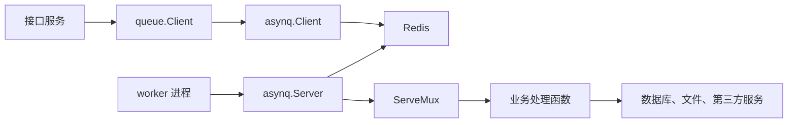
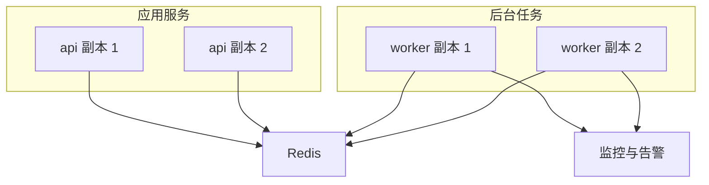

# 07 Asynq 项目集成指南

## 这一节解决什么问题

前面的研究主要解释 Asynq 自身如何工作：任务如何入队、Redis 如何保存状态、worker 如何抢任务、失败后如何重试。本节换一个视角：如果要把 Asynq 集成进一个真实 Go 项目，应该怎样拆目录、怎样放任务定义、怎样启动生产者和消费者，以及哪些边界需要提前设计。

Asynq 集成进业务项目时，最重要的判断是：它不是一个普通工具函数，而是一条新的异步执行链路。原来的请求链路只需要处理同步返回；引入 Asynq 后，系统还会出现“任务已提交但尚未执行”“任务执行失败但会重试”“任务执行成功但请求方已经离开”等状态。因此集成重点不是会不会调用 `Client.Enqueue`，而是业务如何承受异步语义。

## 推荐目录拆分

一个小型项目可以从下面的结构开始：

```text
your-project/
  cmd/
    api/
      main.go
    worker/
      main.go
  internal/
    queue/
      client.go
      tasks.go
      handlers.go
      mux.go
    service/
      order.go
      email.go
```

各文件职责如下：

| 模块 | 职责 |
| --- | --- |
| `internal/queue/tasks.go` | 定义任务类型、载荷结构、创建任务的函数 |
| `internal/queue/client.go` | 封装 Asynq 客户端，业务服务通过这里入队 |
| `internal/queue/handlers.go` | 编写任务处理函数，处理 Redis 中取出的任务 |
| `internal/queue/mux.go` | 注册任务类型和处理函数 |
| `cmd/api/main.go` | 启动接口服务，只负责把耗时工作提交成任务 |
| `cmd/worker/main.go` | 启动 Asynq Server，长期消费任务 |

这样拆分的原因是：生产者和消费者通常不是同一个进程。接口服务需要快速返回，worker 需要长期运行、可扩容、可重启。把两者放在两个入口里，后续才方便独立部署。

## 集成架构



在这个结构里，业务代码不应该到处直接创建 `asynq.Client`。更稳妥的方式是由 `internal/queue` 暴露业务语义清晰的方法，例如：

```go
type Client struct {
    asynq *asynq.Client
}

func (c *Client) EnqueueOrderPaid(ctx context.Context, orderID string) error {
    task, err := NewOrderPaidTask(orderID)
    if err != nil {
        return err
    }
    _, err = c.asynq.EnqueueContext(ctx, task, asynq.Queue("critical"), asynq.MaxRetry(5))
    return err
}
```

这样做的好处是，接口层看到的是“提交订单已支付任务”，而不是一堆队列名、重试次数、超时时间和载荷编码细节。

## 集成步骤

### 第一步：统一 Redis 配置

生产者和消费者必须使用同一组 Redis 配置。最小配置包括：

```go
redisOpt := asynq.RedisClientOpt{
    Addr:     "127.0.0.1:6379",
    Password: "",
    DB:       0,
}
```

实际项目里建议从环境变量或配置中心读取：

| 配置项 | 说明 |
| --- | --- |
| `REDIS_ADDR` | Redis 地址，例如 `127.0.0.1:6379` |
| `REDIS_PASSWORD` | Redis 密码，本地可为空 |
| `REDIS_DB` | Redis 数据库编号，本地可用 `0` |

### 第二步：定义任务类型和载荷

任务类型要稳定，因为它是生产者和消费者之间的协议。建议使用带领域前缀的命名：

```go
const TypeOrderPaid = "order:paid"
```

载荷要小，只放 worker 必须知道的业务标识，不要把整份业务对象塞进去。更推荐传 `order_id`，由 worker 自己读取最新业务数据。

```go
type OrderPaidPayload struct {
    OrderID string `json:"order_id"`
}
```

### 第三步：在接口服务中入队

接口服务里只做三件事：

1. 完成同步事务。
2. 构造任务。
3. 入队并记录任务编号。

如果“业务事务成功，但任务入队失败”会造成严重问题，就需要引入出站表，把任务提交也纳入业务数据库事务，再由独立进程补偿发送。Asynq 本身只保证 Redis 里的任务状态迁移，不会自动帮业务数据库和 Redis 做跨系统事务。

### 第四步：启动 worker

worker 进程通常只做一件事：创建 `asynq.Server`，注册处理函数，然后阻塞运行。

```go
srv := asynq.NewServer(redisOpt, asynq.Config{
    Concurrency: 8,
    Queues: map[string]int{
        "critical": 6,
        "default":  3,
        "low":      1,
    },
})

mux := asynq.NewServeMux()
mux.HandleFunc(TypeOrderPaid, HandleOrderPaid)

if err := srv.Run(mux); err != nil {
    return err
}
```

队列权重体现的是资源倾斜，不是业务正确性。关键任务可以放到高权重队列，但仍然要做好幂等和失败补偿。

## 处理函数的边界

处理函数要遵守三个原则：

1. 可以重复执行。
2. 可以在中途失败。
3. 可以被多个 worker 并发执行。

因此处理函数里不要假设“只会执行一次”。常见做法是：

| 场景 | 推荐做法 |
| --- | --- |
| 写数据库 | 用唯一键或状态机保证幂等 |
| 调第三方接口 | 保存外部请求编号，避免重复扣款或重复发送 |
| 处理非法载荷 | 返回带 `asynq.SkipRetry` 的错误，避免无意义重试 |
| 临时网络失败 | 返回普通错误，让 Asynq 按策略重试 |
| 长任务 | 设置 `Timeout` 或 `Deadline`，避免任务无限占用 worker |

## 部署建议



部署时建议把接口服务和 worker 分开扩容。接口服务的瓶颈通常是请求吞吐，worker 的瓶颈通常是任务处理耗时、外部依赖和 Redis 压力。两者放在同一个进程里会让容量判断变得模糊。

## 本仓库示例

本仓库提供了一个直接连接本机 Redis 的示例：

```sh
cd docs/code-research/asynq/example
go run . worker
```

另开一个终端入队：

```sh
cd docs/code-research/asynq/example
go run . enqueue -user 42 -action signup
```

示例使用 `REDIS_ADDR`、`REDIS_PASSWORD`、`REDIS_DB` 读取 Redis 配置；不设置时默认连接 `127.0.0.1:6379`。worker 会把任务结果写入 `runtime/` 目录，用真实 Redis 完成入队和消费，不使用模拟实现。

示例没有写进 `resource/task-queue/asynq`，因为那里是第三方 submodule。把学习代码放在本仓库自己的研究目录里，后续提交和推送时不会依赖一个无法同步到上游的本地 submodule 提交。

## 集成检查清单

1. 任务类型是否稳定，是否有领域前缀。
2. 任务载荷是否足够小，是否避免携带过期业务快照。
3. 处理函数是否幂等。
4. 是否区分永久失败和临时失败。
5. 是否设置合理的队列、重试次数、超时时间和保留时间。
6. 是否把 api 和 worker 分开部署。
7. 是否有任务积压、失败率、重试次数和 worker 存活的监控。
8. 是否考虑业务数据库成功但 Redis 入队失败的补偿方案。
