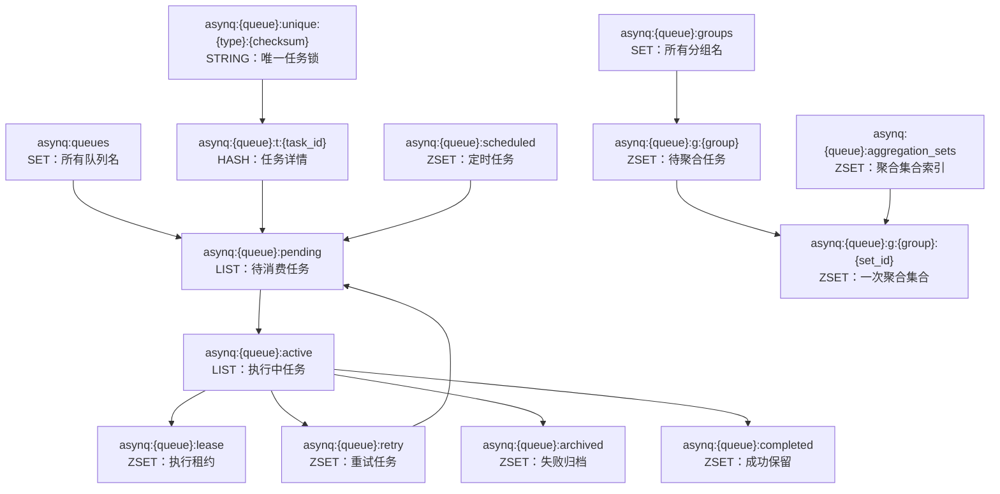

# 08 Redis Key 速查

## 这一节解决什么问题

前面的文档已经解释了 Asynq 的任务生命周期和 Redis 状态空间。本节把源码中所有 Redis key 单独整理成一张可排障、可阅读源码时对照的清单：每个 key 长什么样、用什么 Redis 数据结构、保存什么内容，以及在哪个流程里被读写。

本文基于 `resource/task-queue/asynq/internal/base/base.go` 和 `resource/task-queue/asynq/internal/rdb/rdb.go` 整理。当前源码中的 Asynq 版本是 `0.26.0`。

## 命名规则

Asynq 的队列级 key 统一使用：

```text
asynq:{<qname>}:<suffix>
```

这里的 `{<qname>}` 是 Redis Cluster hash tag。它保证同一个队列下的任务 hash、pending、active、scheduled、retry、archived、completed、lease、group 等 key 落在同一个 hash slot，从而让 Lua 脚本可以在 Redis Cluster 中访问同队列内的多个 key。

几个常用前缀函数：

| 函数 | 结果 | 作用 |
|------|------|------|
| `QueueKeyPrefix(qname)` | `asynq:{<qname>}:` | 队列下所有 key 的公共前缀 |
| `TaskKeyPrefix(qname)` | `asynq:{<qname>}:t:` | 任务详情 hash 的公共前缀 |
| `GroupKeyPrefix(qname)` | `asynq:{<qname>}:g:` | 聚合分组 key 的公共前缀 |

## Redis 原语兼容性

Asynq README 明确要求 Redis `4.0` 或更高版本。源码里没有使用 Redis Stream、RedisJSON、Bloom、Search 这类模块能力，主要依赖 Redis 内置数据结构、Lua 脚本、PubSub 和少量管理命令。使用方如果接的是 Redis 兼容服务，可以按下面清单核对是否支持。

### 数据结构原语

| 原语 | Asynq 中的用途 | 涉及 key |
|------|----------------|----------|
| String | 唯一任务锁、暂停标记、统计计数、server 信息快照 | `unique:*`、`paused`、`processed`、`failed`、`asynq:servers:{...}` |
| Hash | 保存任务详情、worker 快照、任务结果 | `asynq:{<qname>}:t:<task_id>`、`asynq:workers:{...}` |
| List | pending/active 队列、scheduler entry 列表 | `pending`、`active`、`asynq:schedulers:{...}` |
| Set | 队列索引、聚合 group 索引 | `asynq:queues`、`asynq:{<qname>}:groups` |
| Sorted Set | 定时、重试、归档、完成、租约、聚合集合索引、调度历史、分布式信号量 | `scheduled`、`retry`、`archived`、`completed`、`lease`、`aggregation_sets`、`scheduler_history:*`、`asynq:sema:*` |
| PubSub | 广播任务取消通知 | `asynq:cancel` |
| Lua script | 多 key 状态迁移的原子性 | 入队、出队、完成、重试、归档、聚合、清理等流程 |

### 核心运行时命令

这些命令是普通入队、消费、重试、恢复、聚合、心跳和调度会用到的命令。如果 Redis 兼容服务不支持其中某一类，worker 运行时就可能不可用。

| 命令族 | 具体命令 | 用途 |
|--------|----------|------|
| 连接检查 | `PING` | `Client.Ping` 和 healthchecker 探测 Redis 可用性。 |
| 脚本执行 | `EVAL` / `EVALSHA`、`SCRIPT LOAD` | `redis.NewScript(...).Run` 执行 Lua 脚本；批量入队前会预加载脚本，避免 pipeline 中 `EVALSHA` 遇到 `NOSCRIPT`。 |
| String | `SET`、`SET NX EX`、`SETEX`、`GET`、`SETNX`、`INCR`、`EXPIRE`、`EXPIREAT`、`DEL`、`EXISTS` | 写唯一锁、暂停标记、统计计数、server 快照 TTL、删除任务详情或状态 key。 |
| Hash | `HSET`、`HGET`、`HMGET`、`HDEL` | 写任务 `msg/state/result`，读取任务详情，出队时删除 `pending_since`。注意源码使用了一次写多个 field/value 的 `HSET` 形式。 |
| List | `LPUSH`、`RPUSH`、`RPOPLPUSH`、`LRANGE`、`LLEN`、`LREM` | 入队、出队、重新入队、active 移除、scheduler entry 记录。`RPOPLPUSH` 在 Redis 6.2 后被官方标记为 deprecated，但 Redis 7 仍保留；兼容服务如果移除了旧命令会有风险。 |
| Set | `SADD`、`SMEMBERS`、`SREM` | 记录队列名、列出聚合 group、清理空 group。 |
| Sorted Set | `ZADD`、`ZADD XX`、`ZREM`、`ZRANGE`、`ZREVRANGE`、`ZRANGEBYSCORE`、`ZREMRANGEBYSCORE`、`ZREMRANGEBYRANK`、`ZCARD`、`ZSCORE` | 定时/重试到期扫描，lease 续期，归档裁剪，completed 清理，聚合 group 切分。 |
| PubSub | `SUBSCRIBE`、`PUBLISH` | 任务取消通知。 |

### 管理和诊断命令

这些命令主要由 `Inspector`、CLI 或 Web UI 查询状态时使用。缺少它们通常不会影响普通 worker 消费，但会影响队列检查、统计、内存估算、集群展示或管理操作。

| 命令族 | 具体命令 | 用途 |
|--------|----------|------|
| 信息查询 | `INFO`、`CLUSTER INFO` | CLI/Inspector 展示 Redis 或 Redis Cluster 概况。 |
| Cluster 查询 | `CLUSTER KEYSLOT`、`CLUSTER SLOTS` | 查询队列 key 所在 hash slot 和节点。只在连接 Redis Cluster 并调用相关 Inspector 方法时需要。 |
| 内存估算 | `MEMORY USAGE` | `CurrentStats` 估算队列占用内存。该命令属于 Redis 4.0+ 能力，也正好和 Asynq README 的最低版本要求对齐。 |
| 管理读取 | `HVALS`、`ZREVRANGE WITHSCORES`、`SISMEMBER`、`LRANGE`、`SMEMBERS` | 列出 worker、scheduler、任务、队列和 group 状态。 |
| 管理写入 | `SREM`、`DEL`、`SETNX` | 删除队列索引、清理 scheduler history、暂停/恢复队列。 |

### 兼容性判断

1. 如果使用官方 Redis，按 README 要求使用 Redis `4.0+` 即可覆盖当前源码用到的基础原语。
2. 如果使用 Redis Cluster，需要额外注意 Lua 脚本的多 key 限制。同一队列内 key 通过 `{<qname>}` hash tag 保证同 slot，但 README 仍提示部分 Lua 脚本可能不兼容 Redis Cluster。
3. 如果使用云厂商的 Redis 兼容服务，要确认是否支持 Lua scripting、PubSub、`RPOPLPUSH`、`MEMORY USAGE` 和 Cluster 查询命令。有些托管服务会禁用或限制管理命令。
4. `Pipeline` 是 go-redis 客户端批量发送方式，不是 Redis 服务器原语；它依赖服务端正常支持 pipeline 协议和 pipeline 中执行 `EVALSHA`。

## 总览图



## 全局 key

这些 key 不属于某个业务队列，主要用于全局索引、运行时可观测和取消通知。

| Key | 类型 | 内容 | 功能 |
|-----|------|------|------|
| `asynq:queues` | SET | 队列名，例如 `default`、`critical` | 记录已经出现过的队列。`Inspector` 用它列出队列、判断队列是否存在；入队、定时、分组入队时会把队列名写入这里。 |
| `asynq:servers` | ZSET | member 是 `asynq:servers:{<host>:<pid>:<server_id>}`，score 是过期时间戳 | 运行中 server 的索引。心跳写入，检查端按 score 过滤过期 server。 |
| `asynq:workers` | ZSET | member 是 `asynq:workers:{<host>:<pid>:<server_id>}`，score 是过期时间戳 | 运行中 worker 快照 key 的索引。 |
| `asynq:schedulers` | ZSET | member 是 `asynq:schedulers:{<scheduler_id>}`，score 是过期时间戳 | 运行中 scheduler entry 列表 key 的索引。 |
| `asynq:cancel` | PubSub channel | 消息体是任务 ID | 任务取消通知通道。发布方发送 task ID，订阅方收到后取消对应执行上下文。 |

## 队列内任务状态 key

这些 key 都带有 `{<qname>}`，表示它们属于同一个队列。

| Key | 类型 | 内容 | 功能 |
|-----|------|------|------|
| `asynq:{<qname>}:t:<task_id>` | HASH | `msg`、`state`、`pending_since`、`unique_key`、`group`、`result` 等字段 | 单个任务的详情。`msg` 是 protobuf 编码后的 `TaskMessage`；`state` 是任务当前状态；`pending_since` 用于计算队列延迟；`unique_key` 指向唯一任务锁；`group` 记录聚合分组；`result` 保存 handler 写入的结果。 |
| `asynq:{<qname>}:pending` | LIST | task ID | 待消费队列。入队时 `LPUSH`，消费时 `RPOPLPUSH` 到 active，因此普通入队整体表现为 FIFO。队列暂停时不会从这里取任务。 |
| `asynq:{<qname>}:active` | LIST | task ID | 正在执行的任务。出队时任务 ID 从 pending 转到 active；成功、重试、归档、重新入队时会从 active 移除。 |
| `asynq:{<qname>}:lease` | ZSET | member 是 task ID，score 是租约过期 Unix 秒 | active 任务的租约表。heartbeater 续租，recoverer 扫描过期租约，把任务转 retry 或 archived。 |
| `asynq:{<qname>}:scheduled` | ZSET | member 是 task ID，score 是 `process_at` Unix 秒 | 延迟任务和定时任务的等待区。forwarder 定期把到期任务转 pending；如果任务带 group，则转回对应 group。 |
| `asynq:{<qname>}:retry` | ZSET | member 是 task ID，score 是下次重试 Unix 秒 | 失败但还有重试次数的任务。forwarder 到点后转 pending 或 group。 |
| `asynq:{<qname>}:archived` | ZSET | member 是 task ID，score 是归档时间 Unix 秒 | 不再自动重试的失败任务。归档时会按 90 天和最多 10000 条裁剪，同时删除被裁剪任务的 task hash。 |
| `asynq:{<qname>}:completed` | ZSET | member 是 task ID，score 是保留到期 Unix 秒 | 成功且配置了 retention 的任务。janitor 会删除过期 completed 成员和对应 task hash。未配置 retention 的成功任务会直接删除 task hash。 |
| `asynq:{<qname>}:paused` | STRING | 暂停时写入当前 Unix 秒 | 队列暂停标记。只要 key 存在，dequeue 脚本就跳过该队列；`Unpause` 删除它。 |

## 统计 key

统计 key 也是队列级 key，但它们不保存任务 ID，而是保存计数。

| Key | 类型 | 内容 | 功能 |
|-----|------|------|------|
| `asynq:{<qname>}:processed` | STRING 计数器 | 累计处理数 | 队列维度的总处理数，成功和失败都会计入。计数到 `MaxInt64` 时源码会重置为 1。 |
| `asynq:{<qname>}:failed` | STRING 计数器 | 累计失败数 | 队列维度的总失败数。 |
| `asynq:{<qname>}:processed:<yyyy-mm-dd>` | STRING 计数器 | 当天处理数，日期按 UTC 格式化 | 当日处理统计，成功和失败都会计入。首次写入时设置 90 天过期时间。 |
| `asynq:{<qname>}:failed:<yyyy-mm-dd>` | STRING 计数器 | 当天失败数，日期按 UTC 格式化 | 当日失败统计，首次写入时设置 90 天过期时间。 |

这里的“处理数”不是“成功数”。任务执行失败后进入 retry 或 archived，只要被视为一次 failure，也会同时增加 processed 和 failed。

## 唯一任务 key

| Key | 类型 | 内容 | 功能 |
|-----|------|------|------|
| `asynq:{<qname>}:unique:<task_type>:<payload_md5>` | STRING | task ID，带用户指定 TTL | 唯一任务锁。入队前用 `SET NX EX` 抢锁；成功执行后如果锁仍指向当前 task ID，会删除该锁。 |
| `asynq:{<qname>}:unique:<task_type>:` | STRING | task ID，带用户指定 TTL | payload 为 `nil` 时的唯一任务锁，末尾 checksum 为空。 |

唯一性 key 由队列名、任务类型和 payload 的 MD5 组成。它不是任务详情，只是去重锁；任务详情仍在 `asynq:{<qname>}:t:<task_id>`。

## 聚合任务 key

聚合任务相关 key 负责把同一个 group 的任务先攒起来，再切成一次可处理的 aggregation set。

| Key | 类型 | 内容 | 功能 |
|-----|------|------|------|
| `asynq:{<qname>}:groups` | SET | group 名称 | 当前队列中存在待聚合任务的 group 索引。group 清空时会从这里移除。 |
| `asynq:{<qname>}:g:<group_key>` | ZSET | member 是 task ID，score 是进入 group 的 Unix 秒 | 某个 group 的待聚合任务集合。达到最大数量、最大等待时间或 grace period 后，部分任务会被移动到 aggregation set。 |
| `asynq:{<qname>}:g:<group_key>:<aggregation_set_id>` | ZSET | member 是 task ID，score 沿用 group 中的入组时间 | 一次已经切分出来、等待 aggregator 读取处理的聚合集合。aggregator 成功处理后删除集合和其中任务的 task hash。 |
| `asynq:{<qname>}:aggregation_sets` | ZSET | member 是 aggregation set key，score 是聚合处理截止 Unix 秒 | 所有待处理 aggregation set 的索引。recoverer 用它找超时未处理的集合，并把任务放回原 group。 |

聚合任务仍然有 task hash。任务处于 group 或 aggregation set 时，hash 中的 `state` 通常是 `aggregating`，并带有 `group` 字段。

## Server 和 worker 运行时 key

| Key | 类型 | 内容 | 功能 |
|-----|------|------|------|
| `asynq:servers:{<host>:<pid>:<server_id>}` | STRING，带 TTL | 编码后的 `ServerInfo` | 单个 server 进程的运行状态。heartbeater 周期刷新 TTL。 |
| `asynq:workers:{<host>:<pid>:<server_id>}` | HASH，带 TTL | field 是 worker ID，value 是编码后的 `WorkerInfo` | 单个 server 内所有 worker 的当前执行快照。 |

这两个 key 会被 `asynq:servers` 和 `asynq:workers` 两个全局 ZSET 索引。索引的 score 是预计过期时间，实际详情 key 自身也设置 TTL。

## Scheduler key

| Key | 类型 | 内容 | 功能 |
|-----|------|------|------|
| `asynq:schedulers:{<scheduler_id>}` | LIST，带 TTL | 编码后的 scheduler entry | 单个 scheduler 当前管理的周期任务条目。 |
| `asynq:scheduler_history:<entry_id>` | ZSET | member 是编码后的 `SchedulerEnqueueEvent`，score 是入队 Unix 秒 | 某个周期任务条目的入队历史。源码最多保留 `1000` 条。 |

`asynq:schedulers:{<scheduler_id>}` 会被 `asynq:schedulers` 全局 ZSET 索引。周期任务真正生成任务后，任务本身仍进入普通队列状态 key，例如 pending 或 scheduled。

## 扩展包 key

`resource/task-queue/asynq/x/rate/semaphore.go` 中还有一个分布式信号量 key。它不是核心队列状态的一部分，但属于 Asynq 扩展包的 Redis key。

| Key | 类型 | 内容 | 功能 |
|-----|------|------|------|
| `asynq:sema:<scope>` | ZSET | member 是 task ID，score 是任务 context deadline 的 Unix 秒 | `x/rate.Semaphore` 的分布式并发控制。获取令牌时删除过期成员，再判断当前成员数是否小于最大并发；释放时删除当前 task ID。 |

## 生命周期对照

| 场景 | 主要 key 变化 |
|------|---------------|
| 立即入队 | 写 task hash，`LPUSH pending`，必要时写 `asynq:queues` 和 unique key。 |
| 延迟入队 | 写 task hash，`ZADD scheduled`，score 是 `process_at`。 |
| 聚合入队 | 写 task hash，`ZADD g:<group_key>`，`SADD groups`。 |
| worker 出队 | `RPOPLPUSH pending active`，task hash 状态改为 `active`，`ZADD lease`。 |
| 执行成功且无 retention | 从 `active` 和 `lease` 移除，删除 task hash，增加 processed 统计。 |
| 执行成功且有 retention | 从 `active` 和 `lease` 移除，`ZADD completed`，task hash 状态改为 `completed`，增加 processed 统计。 |
| 执行失败且可重试 | 从 `active` 和 `lease` 移除，`ZADD retry`，task hash 状态改为 `retry`，增加 processed/failed 统计。 |
| 执行失败且不可重试 | 从 `active` 和 `lease` 移除，`ZADD archived`，task hash 状态改为 `archived`，增加 processed/failed 统计。 |
| scheduled/retry 到期 | 从 delayed zset 移除，普通任务进入 `pending`，带 group 的任务进入 `g:<group_key>`。 |
| lease 过期恢复 | recoverer 从 `lease` 找过期任务，再转 `retry` 或 `archived`。 |
| completed 过期清理 | janitor 从 `completed` 找过期任务，删除 completed 成员和 task hash。 |
| aggregation set 处理成功 | 删除 aggregation set key、从 `aggregation_sets` 移除，并删除集合内任务的 task hash。 |

## 排障时怎么查

1. 先看 `asynq:queues`，确认队列是否被 Asynq 记录。
2. 再看 `asynq:{<qname>}:pending`、`active`、`scheduled`、`retry`、`archived`、`completed` 的长度，判断任务卡在哪个状态。
3. 对具体 task ID 查 `asynq:{<qname>}:t:<task_id>`，看 `state`、`msg`、`pending_since`、`group`、`unique_key` 和 `result`。
4. 如果任务卡 active，看 `asynq:{<qname>}:lease` 的 score 是否已经过期。
5. 如果任务没有按时执行，看 `scheduled` 或 `retry` 的 score 是否已经小于当前 Unix 秒，以及 forwarder 是否运行。
6. 如果聚合任务没有触发，看 `groups`、`g:<group_key>`、`aggregation_sets` 和对应 aggregation set key。
7. 如果唯一任务重复，查 task hash 中的 `unique_key`，再查对应 `unique` key 的值和 TTL。

## 容易混淆的点

1. `pending` 和 `active` 都是 LIST，但 `scheduled`、`retry`、`archived`、`completed`、`lease`、`group` 都是 ZSET。ZSET 的 score 含义因 key 而异。
2. `processed` 统计包含成功和失败，不等于成功数。
3. `completed` 只保存配置了 retention 的成功任务；默认成功任务会直接删除 task hash。
4. `archived` 是失败归档状态，不等于 Redis key 永久保留。源码会按时间和数量裁剪。
5. `unique` key 是锁，不是任务本体。真正的任务数据永远在 task hash 的 `msg` 字段里。
6. Redis Cluster 下，同一队列的 key 靠 `{<qname>}` 保证同 slot；跨队列迁移不是 Asynq 核心脚本的工作方式。
