# 09 从 0 设计 Asynq：一步一步演进

## 这一节解决什么问题

如果不先看源码，而是从 0 开始设计一套 Asynq，我们会怎样一步一步把它完善成现在的样子？

最自然的起点确实是两个队列：

- `pending`：保存待执行任务。
- `complete`：保存已经执行完成的任务。

但只要开始追问“服务重启怎么办”“任务执行到一半进程崩了怎么办”“失败要不要重试”“延迟任务怎么按时间触发”“成功结果要不要长期保存”，这两个队列很快就不够用了。Asynq 的真实设计可以理解为：围绕 `pending` 这个最小队列，不断补上可靠性、时间调度、失败处理、可观测和扩展能力。

本文用“从 0 设计”的方式推演 Asynq 的演进过程。它不是源码调用链，而是设计路线图；每一步都会说明为什么要新增一个状态、一个 Redis key 或一个后台组件。

## 总体演进地图

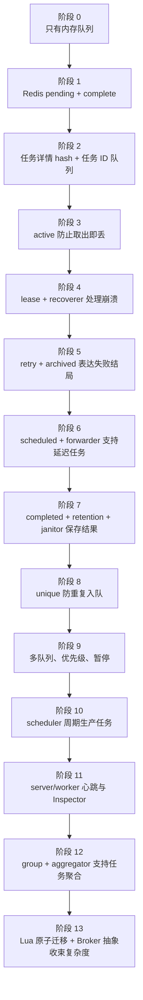

| 阶段 | 新增能力 | 新增核心 key 或组件 | 解决的问题 | 付出的复杂度 |
|------|----------|---------------------|------------|--------------|
| 0 | 内存任务队列 | 内存 slice/channel | 能异步执行任务 | 进程退出任务全丢 |
| 1 | Redis 持久队列 | `pending`、`complete` | 服务重启后任务还在 | 任务详情和状态混在一起 |
| 2 | 任务详情与状态分离 | `t:<task_id>` | 队列只存 ID，任务可按 ID 查询 | 需要维护 hash 和队列一致性 |
| 3 | 执行中状态 | `active` | worker 取出任务后不会立刻从系统消失 | active 卡死需要恢复机制 |
| 4 | 租约恢复 | `lease`、`recoverer`、`heartbeater` | worker 崩溃后任务能被重新处理 | 要处理租约续期和过期判断 |
| 5 | 失败状态机 | `retry`、`archived` | 失败可重试，重试耗尽可排查 | 需要重试策略和失败统计 |
| 6 | 延迟执行 | `scheduled`、`forwarder` | 支持未来某个时间执行 | 需要后台推进时间状态 |
| 7 | 成功保留 | `completed`、`janitor` | 可短期查看成功结果 | 需要保留期和清理策略 |
| 8 | 唯一任务 | `unique:*` | 防止同类任务重复入队 | 需要锁 TTL 和释放语义 |
| 9 | 多队列治理 | `asynq:queues`、`paused` | 支持优先级、隔离和暂停 | 出队策略更复杂 |
| 10 | 周期任务 | `Scheduler`、scheduler keys | 按 cron 自动产生任务 | 调度器也要心跳和历史 |
| 11 | 可观测与控制 | server/worker keys、`cancel` | 看见运行中 worker，能取消任务 | 需要运行时快照和 PubSub |
| 12 | 聚合任务 | `groups`、`g:*`、`aggregation_sets` | 小任务攒批处理 | 多了一套等待和恢复状态 |
| 13 | 一致性收束 | `Broker`、`RDB`、Lua 脚本 | 多 key 迁移保持原子 | Redis 脚本和抽象层增多 |

## 阶段 0：最小任务队列

第一版只要做到“请求线程把任务扔出去，后台 worker 慢慢处理”。这时甚至不需要 Redis。


| 设计点 | 最小选择 | 问题 |
|--------|----------|------|
| 任务载体 | `{type, payload}` | 没有任务 ID，不方便查某个任务 |
| 队列 | 内存 channel/list | 进程重启任务丢失 |
| 完成状态 | 不记录 | 无法知道任务是否成功 |
| 失败处理 | 打日志 | 无法重试 |

这个版本适合单进程、低价值任务。一旦任务不能丢，就必须把队列状态放到外部存储。

## 阶段 1：把 pending 和 complete 放进 Redis

你提到的起点是合理的：既然要发送任务，至少需要一个待执行队列；既然要知道任务执行完了，也可以先放一个完成队列。

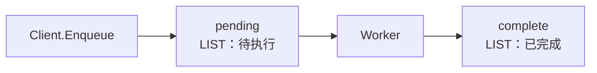

这一版可能长这样：

| Key | 类型 | 保存内容 | 作用 |
|-----|------|----------|------|
| `pending` | LIST | 完整任务 JSON 或 task ID | 等待 worker 消费 |
| `complete` | LIST | 完成任务 JSON 或 task ID | 记录成功任务 |

但它马上会遇到三个问题：

1. 如果队列里直接塞完整任务，按任务 ID 查询、更新重试次数、记录错误都很别扭。
2. worker 从 `pending` pop 出任务后，还没处理完进程就崩了，这个任务已经从 Redis 消失。
3. `complete` 如果无限增长，Redis 会越来越大；如果不保存，又查不到成功结果。

所以第二步要把“任务本体”和“任务在哪个状态”拆开。

## 阶段 2：任务详情 hash 与状态队列分离

真实 Asynq 的设计不是在每个队列里保存完整任务，而是：

- 任务详情保存在 `asynq:{<qname>}:t:<task_id>`。
- 各状态队列只保存 task ID。

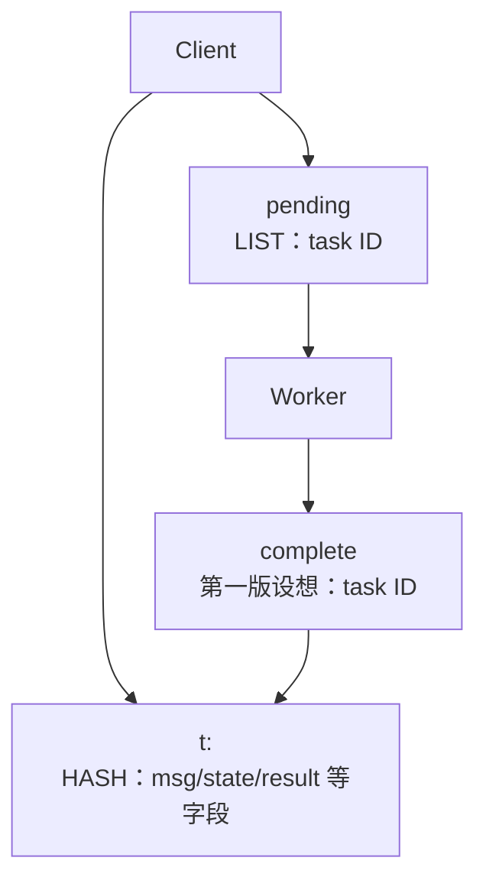

| 设计选择 | 为什么这样做 |
|----------|--------------|
| 队列只存 task ID | Redis list/zset 更轻，状态迁移只移动 ID |
| task hash 存 `msg` | `TaskMessage` 可以包含 retry、timeout、deadline、group、unique 等元信息 |
| task hash 存 `state` | Inspector 可以只查 hash 就知道任务当前状态 |
| task hash 存扩展字段 | `pending_since`、`result`、`unique_key`、`group` 不必塞进队列结构 |

从这一步开始，队列系统变成“状态索引 + 任务详情”的双层模型。

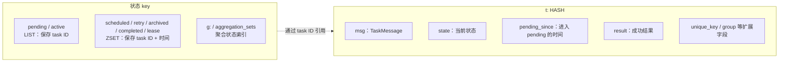

## 阶段 3：引入 active，避免“取出即丢”

只用 `pending` 时，worker 的典型流程是：

```text
POP pending -> 执行业务 -> 写 complete
```

危险点在第一步：任务一旦被 pop 出来，Redis 里就没有它了。如果 worker 在执行业务前崩溃，任务就丢了。

因此需要 `active`：

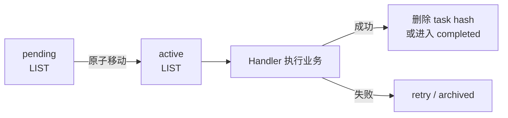

| 状态 | 含义 | 为什么需要 |
|------|------|------------|
| `pending` | 等待被 worker 领取 | 表示还没有开始处理 |
| `active` | 已被 worker 领取，正在执行 | 表示任务没有丢，只是暂时归某个 worker 处理 |

真实 Asynq 出队时用 Lua 脚本完成：

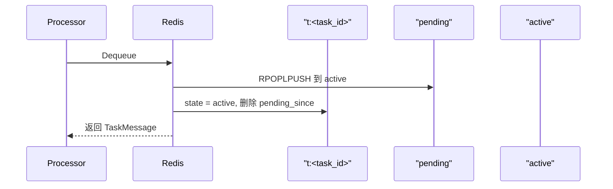

到这里任务不会“取出即丢”了，但还有一个新问题：如果 worker 崩在 active，谁知道它已经死了？

## 阶段 4：引入 lease，让 active 可以恢复

`active` 只能表达“任务被拿走了”，不能表达“拿走任务的 worker 还活着”。所以需要租约。

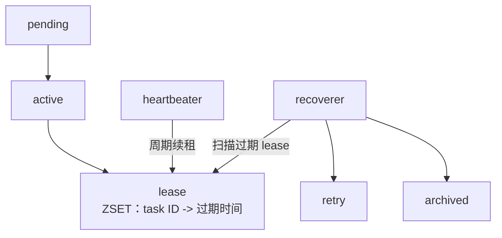

| 组件 | 职责 | 对应设计问题 |
|------|------|--------------|
| `lease` | 记录 active 任务的处理截止时间 | 怎么判断 worker 是否失联 |
| `heartbeater` | worker 正常运行时延长 lease | 长任务不能被误恢复 |
| `recoverer` | 找到 lease 过期的 active 任务 | 崩溃 worker 留下的任务要重新流转 |

租约把系统从“相信 worker 会正常退出”变成“承认 worker 会崩溃，并设计恢复路径”。

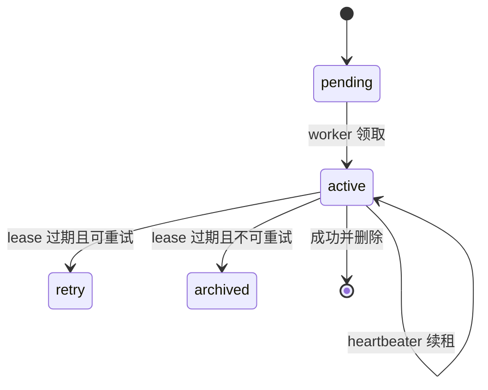

## 阶段 5：把失败拆成 retry 和 archived

第一版的 `complete` 只表达成功，失败怎么办还没定义。真实系统里失败至少有两种含义：

- 临时失败：网络抖动、依赖不可用，稍后重试。
- 终局失败：重试耗尽、业务明确要求跳过重试，需要归档排查。

因此需要 `retry` 和 `archived`。

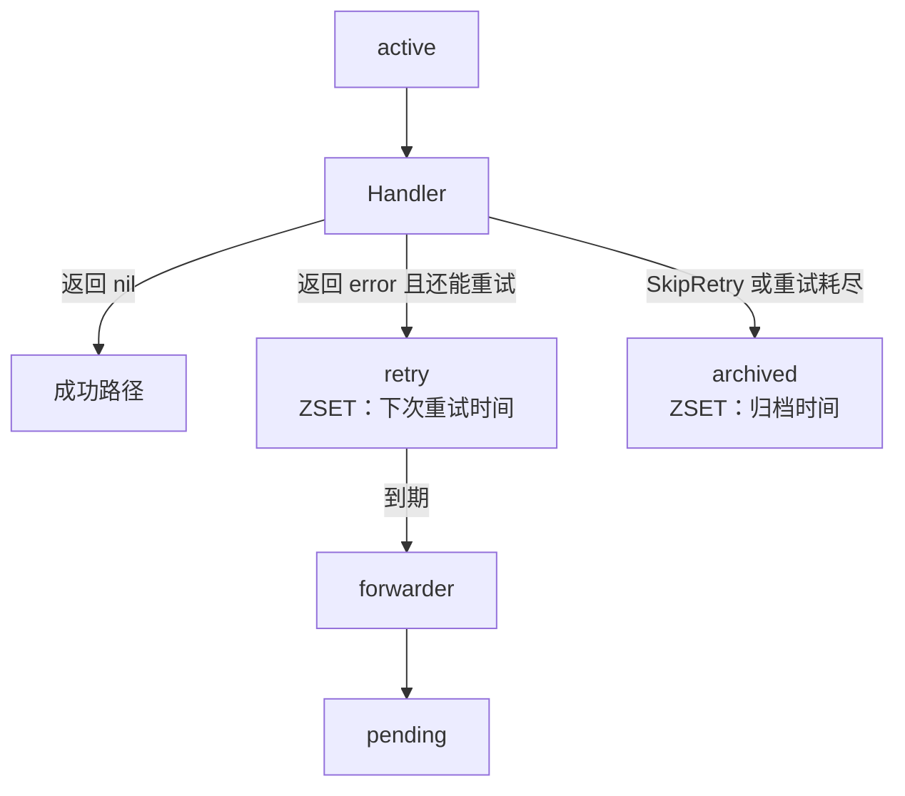

| Key | 类型 | score 含义 | 为什么用 ZSET |
|-----|------|------------|---------------|
| `retry` | ZSET | 下次重试时间 | 需要按时间找“已经可以重试”的任务 |
| `archived` | ZSET | 归档时间 | 需要按时间裁剪旧失败任务 |

失败路径还会更新统计：

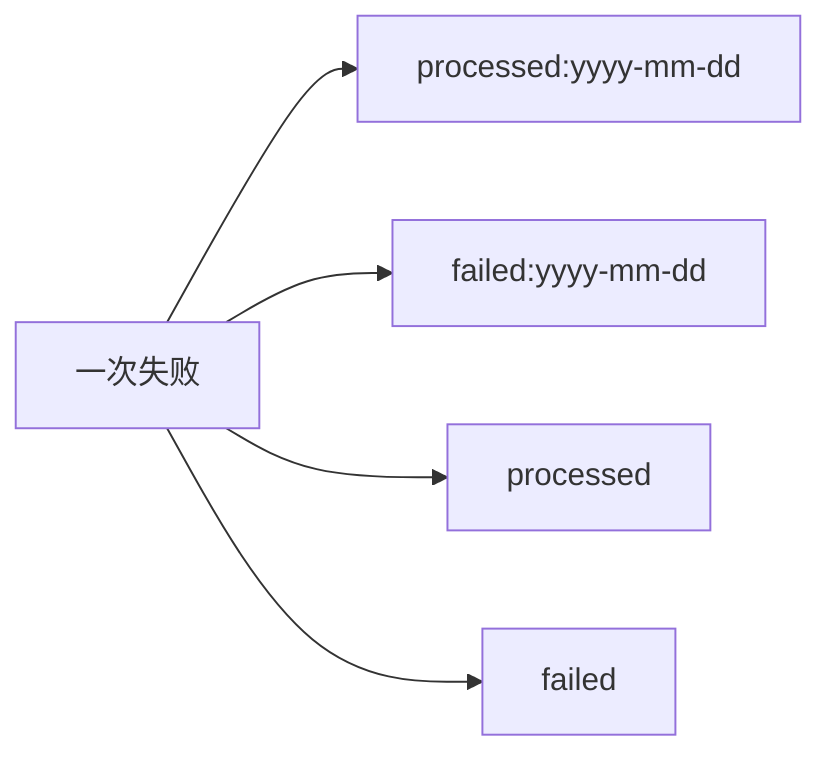

这里有一个容易混淆的点：`processed` 不是成功数。失败任务只要完成了一次处理尝试，也会增加 `processed`。

## 阶段 6：引入 scheduled 和 forwarder，支持延迟执行

接下来业务会提出：任务不是现在执行，而是 10 分钟后执行，或者某个具体时间执行。此时 `pending` 不够，因为 pending 一进来就会被 worker 消费。

所以需要 `scheduled`：

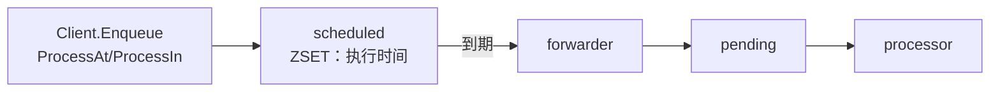

`scheduled` 和 `retry` 很像，都是“未来某个时间再进入 pending”。因此 Asynq 用同一个 `forwarder` 处理两类延迟集合。

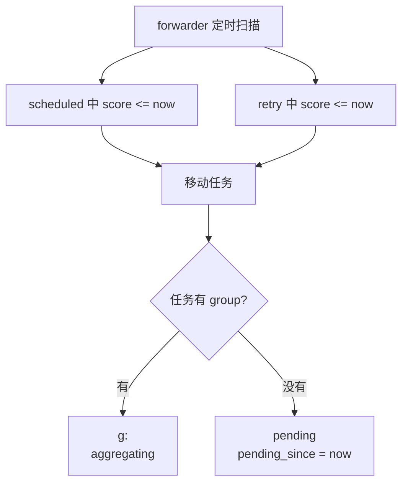

| 状态 | 谁写入 | 谁推进 | 下一站 |
|------|--------|--------|--------|
| `scheduled` | Client 或 Scheduler | forwarder | `pending` 或 `g:<group>` |
| `retry` | processor/recoverer | forwarder | `pending` 或 `g:<group>` |

## 阶段 7：把 complete 演进成 completed + retention + janitor

最开始我们可能设计一个 `complete` 队列保存全部完成任务。但完整系统会发现：

1. 大部分成功任务不需要保存，保存只会浪费 Redis。
2. 少数任务需要保存结果，比如让调用方稍后查询。
3. 保存成功任务必须有过期时间，否则 completed 会无限增长。

所以真实 Asynq 选择：

- 默认成功：从 `active`、`lease` 和 task hash 中删除。
- 配置了 retention：进入 `completed`，并在 task hash 里保留 `result` 和完成信息。
- 到期后：`janitor` 清理 `completed` 和 task hash。

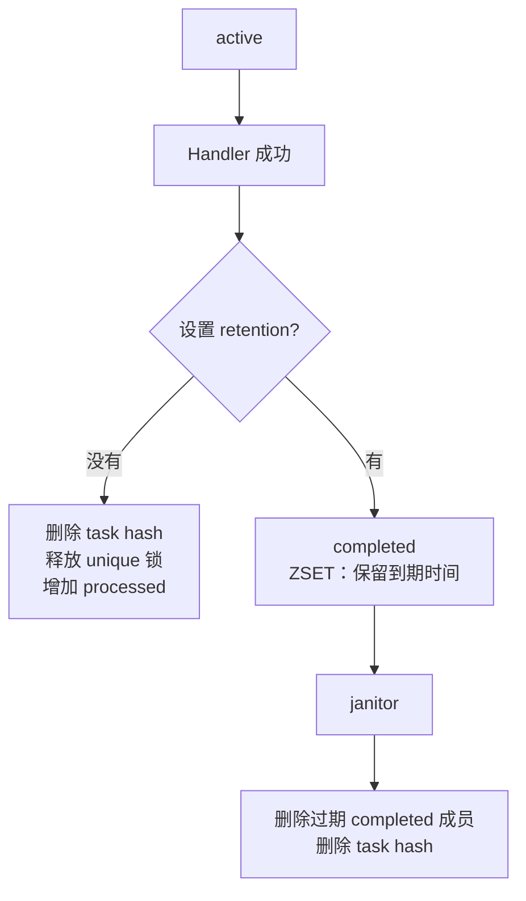

| 早期直觉 | 最终设计 | 原因 |
|----------|----------|------|
| `complete` 保存所有成功任务 | 默认成功后删除 | 大多数成功任务没有查询价值 |
| 完成队列用 LIST | `completed` 用 ZSET | 需要按保留到期时间清理 |
| 成功结果总是保存 | 只有 retention 时保存 | 控制 Redis 存储成本 |

这一步很关键：Asynq 不是没有“完成状态”，而是把完成状态设计成可选保留，而不是永久完成队列。

## 阶段 8：加唯一任务，避免重复入队

业务还会遇到“同一个任务被重复提交”的问题。例如同一个用户同一个 payload 的导出任务，不希望短时间内重复执行。

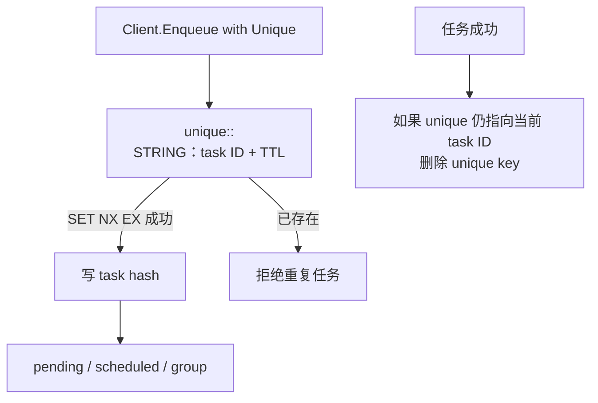

| 设计点 | 说明 |
|--------|------|
| key 包含 task type | 不同类型任务不互相去重 |
| key 包含 payload MD5 | 同类型不同 payload 可以并存 |
| key 带 TTL | 避免 worker 崩溃后锁永久存在 |
| 成功后释放 | 让下一轮相同任务可以重新提交 |

唯一任务不是任务状态，它更像“入队前的分布式锁”。

## 阶段 9：多队列、优先级和暂停

真实业务不会只有一个队列。高优先级任务、低优先级任务、默认任务最好隔离，否则慢任务可能拖垮全部处理。

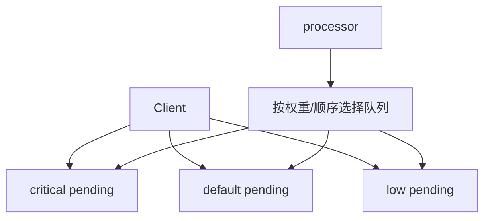

同时还需要队列级治理能力：

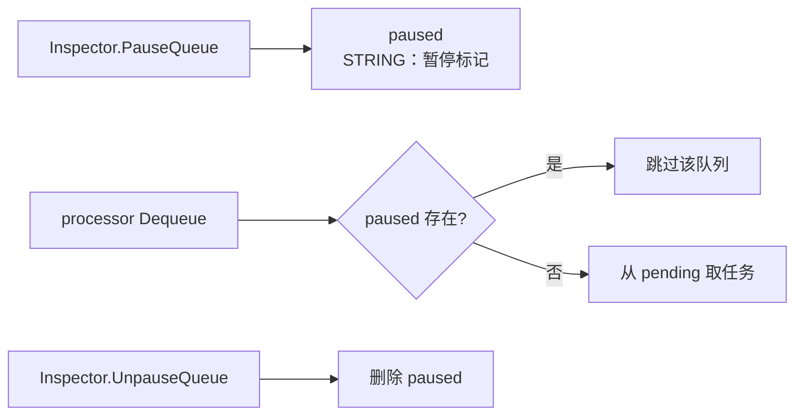

| Key | 用途 |
|-----|------|
| `asynq:queues` | 记录出现过的队列名，Inspector 可以列出队列 |
| `asynq:{<qname>}:paused` | 队列暂停标记，存在时 dequeue 跳过 |
| `asynq:{<qname>}:pending` | 每个队列独立的待消费 list |

队列维度的 key 统一使用 `asynq:{<qname>}:...`，这也为 Redis Cluster 下同队列多 key 脚本落到同一个 slot 打基础。

## 阶段 10：Scheduler 让系统自己生产任务

到这里 Client 只能响应外部调用入队。很多后台任务需要按 cron 周期产生，比如每天清理数据、每分钟同步状态。

所以新增 `Scheduler`：

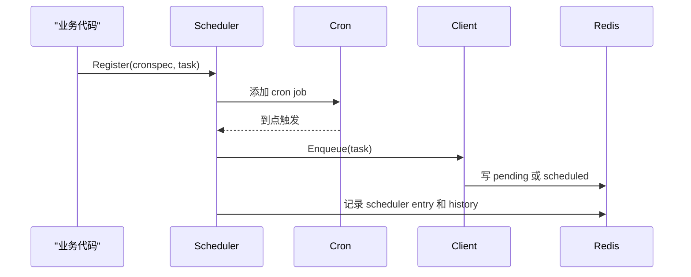

| 设计点 | 为什么这样设计 |
|--------|----------------|
| Scheduler 依赖 Client | 周期任务本质上还是“生产任务”，不应绕过入队逻辑 |
| Scheduler 有自己的心跳 key | Inspector 需要知道哪些调度器还活着 |
| Scheduler 记录 history | 方便排查某个周期任务是否按时入队 |

Scheduler 不处理任务，它只负责按时间创建任务；任务处理仍交给普通 Server。

## 阶段 11：可观测、取消和运行时控制

当 worker 变多后，用户会问：

- 当前有哪些 server 活着？
- 哪些 worker 正在执行什么任务？
- 某个任务能不能取消？
- 队列处理了多少任务、失败了多少任务？

于是需要运行时快照和控制通道。

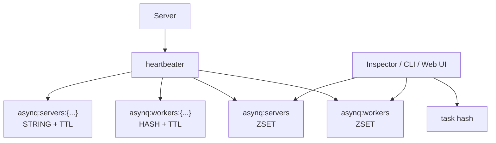

取消任务适合用 PubSub：

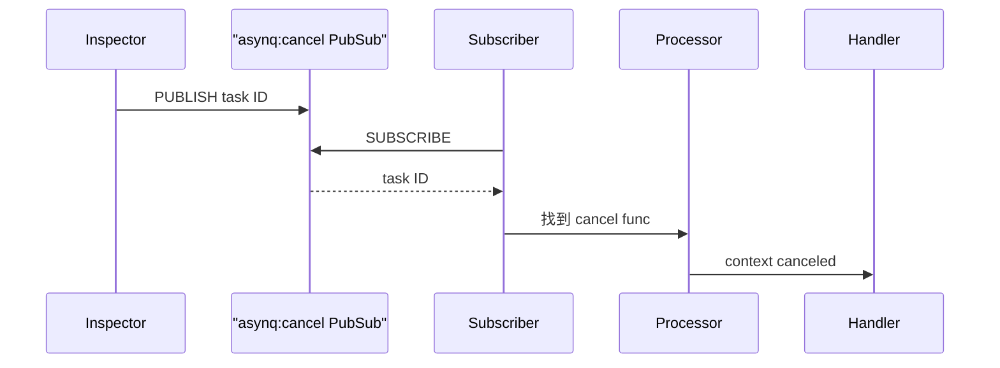

| 能力 | Redis 表达 | 说明 |
|------|------------|------|
| server 列表 | `asynq:servers` + server info key | server 心跳和过期过滤 |
| worker 列表 | `asynq:workers` + workers hash | worker 当前执行快照 |
| 任务取消 | `asynq:cancel` PubSub | 广播 task ID 给各 server |
| 统计 | `processed`、`failed` | 队列级总量和日统计 |

这一步让 Asynq 从“能跑任务”变成“能运维任务”。

## 阶段 12：group 与 aggregator 支持攒批处理

有些任务单个处理太细碎，比如一批同类事件可以合并成一个批处理任务。此时需要“先不进 pending，而是进入聚合缓冲区”。

```mermaid
flowchart TD
    Client["Client.Enqueue with Group"] --> Group["g:<group><br/>ZSET：待聚合任务"]
    Group --> GroupIndex["groups<br/>SET：有哪些 group"]
    Aggregator["aggregator"] --> Check{"达到聚合条件?"}
    Check -->|"未达到"| Group
    Check -->|"达到"| AggSet["g:<group>:<set_id><br/>ZSET：一次聚合集合"]
    AggSet --> AggIndex["aggregation_sets<br/>ZSET：集合处理截止时间"]
    Aggregator --> AggregateFunc["用户 AggregationFunc"]
    AggregateFunc --> NewTask["生成一个新任务"]
    NewTask --> Pending["pending"]
```

聚合能力带来的状态更多，所以还需要恢复逻辑：

```mermaid
flowchart LR
    AggSet["aggregation set"] -->|"处理成功"| Delete["删除 set 和原任务 hash"]
    AggSet -->|"处理超时"| Recoverer["recoverer"]
    Recoverer --> Group["放回原 group"]
```

| Key | 类型 | 作用 |
|-----|------|------|
| `groups` | SET | 当前队列有哪些 group |
| `g:<group>` | ZSET | 等待聚合的原始任务 |
| `g:<group>:<set_id>` | ZSET | 已切出来等待 aggregator 处理的一批任务 |
| `aggregation_sets` | ZSET | 所有待处理 aggregation set 的索引和截止时间 |

这一步体现了 Asynq 的一个设计习惯：新增高级能力时，不直接污染 `pending -> active -> retry` 主流程，而是加一层专门状态。

## 阶段 13：用 Lua 和 Broker 把复杂度收束

演进到这里，一个状态迁移往往要同时改多个 key。比如执行成功要：

1. 从 `active` 移除 task ID。
2. 从 `lease` 移除 task ID。
3. 删除 task hash，或写入 `completed`。
4. 更新 `processed` 统计。
5. 必要时释放 `unique` key。

如果这些 Redis 命令分开发，中间任意一步失败都会留下脏状态。所以 Asynq 把关键迁移放进 Lua 脚本。

```mermaid
flowchart TD
    Operation["一次状态迁移"] --> Lua["Lua 脚本"]
    Lua --> K1["旧状态 key"]
    Lua --> K2["新状态 key"]
    Lua --> K3["task hash"]
    Lua --> K4["统计或锁"]
    Lua --> Atomic["Redis 单线程执行<br/>对外呈现原子结果"]
```

Go 侧也要收束复杂度。公开 API 不应该直接操作 Redis，内部组件也不应该散落 Redis 命令。因此有两层边界：

```mermaid
flowchart TD
    Public["公开 API<br/>Client / Server / Scheduler / Inspector"] --> Broker["Broker 接口<br/>任务队列语义"]
    Broker --> RDB["RDB<br/>Redis 实现"]
    RDB --> Lua["Lua 脚本"]
    RDB --> Redis["Redis 数据结构"]
```

| 层 | 关注点 | 不关心什么 |
|----|--------|------------|
| 业务代码 | 创建任务、处理任务 | Redis key、Lua 脚本 |
| `Client` / `Server` | 入队、消费、调度、恢复 | Redis 命令细节 |
| `Broker` | 队列语义接口 | 具体存储实现 |
| `RDB` | Redis key、脚本、数据结构 | 业务 handler 逻辑 |
| Lua 脚本 | 单次状态迁移原子性 | Go 侧调度策略 |

## 最终完整流程图

把所有演进合起来，最终的 Asynq 可以画成下面这张图：

```mermaid
flowchart TD
    Client["Client.Enqueue"] --> Option{"入队选项"}
    Client --> TaskHash["t:<task_id><br/>HASH：任务详情"]

    Option -->|"立即任务"| Pending["pending<br/>LIST：待处理"]

    Option -->|"ProcessAt / ProcessIn"| Scheduled["scheduled<br/>ZSET：执行时间"]
    Option -->|"Group"| Group["g:<group><br/>ZSET：待聚合"]
    Option -->|"Unique"| Unique["unique:<type>:<payload_md5><br/>STRING：去重锁"]
    Unique --> TaskHash

    Scheduled --> Forwarder["forwarder"]
    Retry["retry<br/>ZSET：下次重试时间"] --> Forwarder
    Forwarder -->|"普通任务到期"| Pending
    Forwarder -->|"分组任务到期"| Group

    Group --> Aggregator["aggregator"]
    Aggregator --> AggSet["g:<group>:<set_id><br/>ZSET：聚合集合"]
    AggSet --> AggregatedTask["聚合后新任务"]
    AggregatedTask --> Pending

    Pending --> Processor["processor"]
    Processor --> Active["active<br/>LIST：执行中"]
    Active --> Lease["lease<br/>ZSET：租约"]
    Processor --> Handler["Handler"]

    Heartbeater["heartbeater"] --> Lease
    Recoverer["recoverer"] -->|"lease 过期"| Lease
    Recoverer --> Retry
    Recoverer --> Archived["archived<br/>ZSET：失败归档"]

    Handler -->|"成功，无 retention"| Delete["删除 task hash"]
    Handler -->|"成功，有 retention"| Completed["completed<br/>ZSET：保留到期时间"]
    Handler -->|"失败，可重试"| Retry
    Handler -->|"失败，不重试"| Archived

    Completed --> Janitor["janitor"]
    Janitor --> Delete

    Scheduler["Scheduler"] --> Client
    Inspector["Inspector"] --> TaskHash
    Inspector --> Pending
    Inspector --> Active
    Inspector --> Scheduled
    Inspector --> Retry
    Inspector --> Archived
    Inspector --> Completed
```

## 最终状态机

```mermaid
stateDiagram-v2
    [*] --> pending: 立即入队
    [*] --> scheduled: 延迟入队
    [*] --> aggregating: group 入队

    scheduled --> pending: forwarder 到期
    scheduled --> aggregating: 到期但带 group
    retry --> pending: forwarder 到期
    retry --> aggregating: 到期但带 group

    aggregating --> pending: aggregator 生成新任务
    pending --> active: processor 出队

    active --> completed: 成功且 retention > 0
    active --> [*]: 成功且无 retention
    active --> retry: 失败且仍可重试
    active --> archived: SkipRetry 或重试耗尽
    active --> pending: 关机 requeue
    active --> retry: lease 过期恢复

    completed --> [*]: janitor 到期清理
    archived --> [*]: archive 裁剪清理
```

## 设计演进背后的几条原则

| 原则 | 在 Asynq 里的体现 |
|------|-------------------|
| 队列只保存状态索引 | `pending`、`active`、`retry` 等只保存 task ID，详情统一在 task hash |
| 状态迁移必须原子 | 入队、出队、成功、重试、归档、转发都用 Lua 脚本 |
| active 必须有恢复机制 | `active` 搭配 `lease`、`heartbeater`、`recoverer` |
| 时间相关状态用 ZSET | `scheduled`、`retry`、`completed`、`archived`、`lease` 都靠 score 表示时间 |
| 成功结果默认不保存 | 只有配置 retention 才进入 `completed` |
| 高级能力绕开主干复杂度 | scheduler、aggregator、inspector 都围绕主状态机扩展，而不是改变 pending/active 核心语义 |
| 公开 API 保持简单 | 业务只看 `Task`、`Client`、`Server`、`Handler`，内部才处理 Redis key |

## 如果自己从 0 实现，推荐的里程碑

```mermaid
gantt
    title 从 0 实现一个 Asynq-like 队列的推荐顺序
    dateFormat  YYYY-MM-DD
    axisFormat  %m-%d

    section 最小可用
    Task 与 Client              :a1, 2026-01-01, 2d
    pending 入队和 worker 消费   :a2, after a1, 2d
    task hash 与 task ID 队列     :a3, after a2, 2d

    section 可靠性
    active 状态                 :b1, after a3, 2d
    lease 与 heartbeater         :b2, after b1, 2d
    recoverer 恢复              :b3, after b2, 2d

    section 失败与时间
    retry 和 archived            :c1, after b3, 2d
    scheduled 和 forwarder       :c2, after c1, 2d
    completed retention 和 janitor :c3, after c2, 2d

    section 治理与扩展
    多队列和暂停                 :d1, after c3, 2d
    统计、Inspector、取消         :d2, after d1, 2d
    Scheduler 和 Aggregator       :d3, after d2, 3d
```

| 里程碑 | 验收标准 |
|--------|----------|
| 最小可用 | 能入队、能消费、成功后不重复执行 |
| 可靠消费 | worker 崩溃后任务能从 active 恢复 |
| 失败处理 | 可重试失败进入 retry，终局失败进入 archived |
| 时间调度 | 延迟任务不会提前消费，到期后能进入 pending |
| 成功保留 | 默认删除成功任务，配置 retention 后可查询并自动清理 |
| 生产治理 | 支持多队列、暂停、统计、取消、查看 worker |
| 高级能力 | 支持周期任务和 group 聚合 |

## 和 08 Redis Key 文档的关系

08 是“当前源码里有哪些 Redis key，以及每个 key 的功能”。09 是“为什么会演进出这些 key”。两篇可以配合读：

```mermaid
flowchart LR
    Read09["先读 09<br/>理解设计为什么这样长出来"] --> Read08["再读 08<br/>对照每个 Redis key 的用途"]
    Read08 --> Code["回源码<br/>看 RDB Lua 脚本和后台组件"]
```

如果只记一条主线，可以这样概括：

```text
pending 让任务能被消费；
active + lease 让任务不会因为 worker 崩溃而丢；
retry / scheduled 用 ZSET 表达未来某个时间再处理；
archived / completed 表达终局状态；
heartbeater / recoverer / forwarder / janitor / aggregator 是推动这些状态继续流转的后台组件；
Lua 脚本保证每次状态切换不会卡在半路。
```
